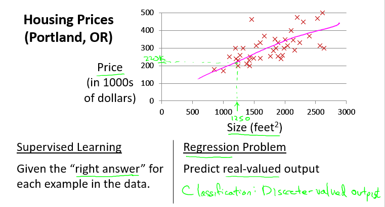
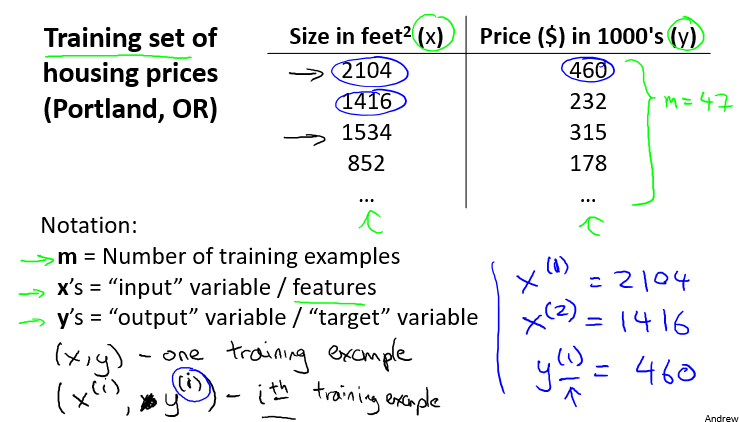
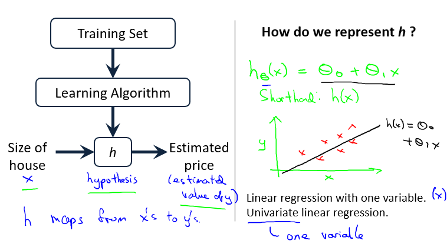

### Model Pepresentation

- 例子
  - 预测房价/根据不同的房屋大小/画出整个图
  - 朋友的房子/1250平方尺/可以卖多少钱?
  - 构建模型/直线/估计大约220k
  - 这是一个监督学习算法的例子
- 回归问题
  - 根据之前的数据预测一个准确的输出值
- 分类问题
  - 预测离散的输出值

[监督学习中有一个数据集/训练集]

- $m$:训练集中的实例数目
- $x$:输入变量/特征
- $y$:输出变量/目标
- $\left( x,y \right)$:训练集中的实例
- $\left( {x}^{(i)},{y}^{(i)}\right)$:第i个实例

- $h$:解决方案/假设
- 在这/$h$代表一个函数/输入房屋大小/$h$根据$x$得出$y$
- $h$是$x$到$y$的函数映射
- $h_\theta \left(x\right)=\theta_{0}+\theta_{1}x$/只含有一个输入变量
- 这类问题就是单变量线性回归问题

### Cost Function

- 回顾线性回归例子
  - $m$:代表训练样本数量
  - Hypothesis:$h_\theta \left(x\right)=\theta_{0}+\theta_{1}x$
- 合适参数$\theta_0$和$\theta_1$

