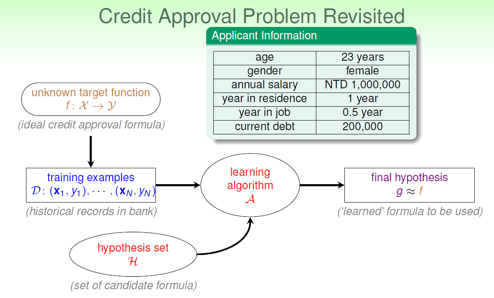
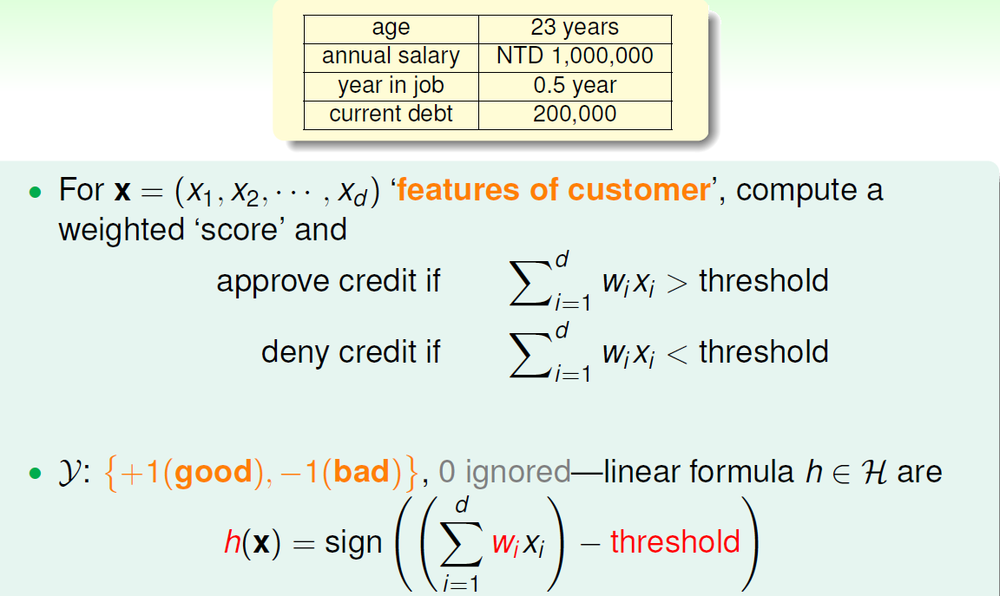
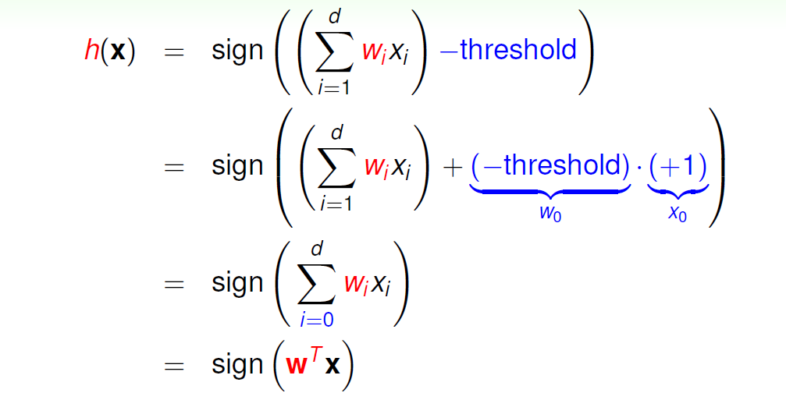
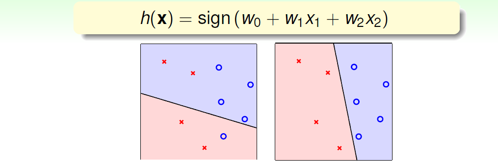
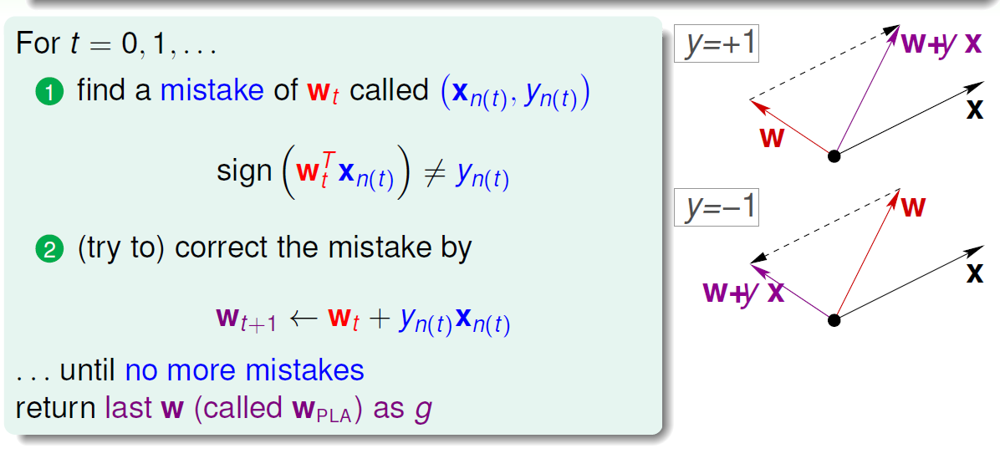
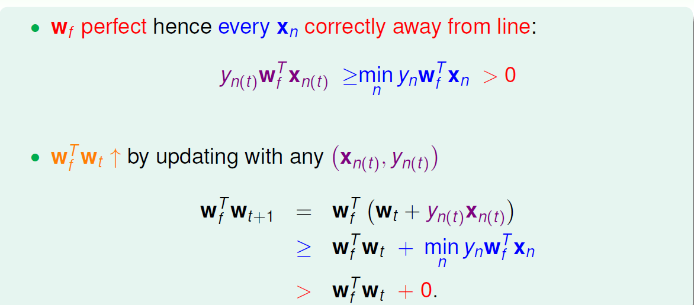
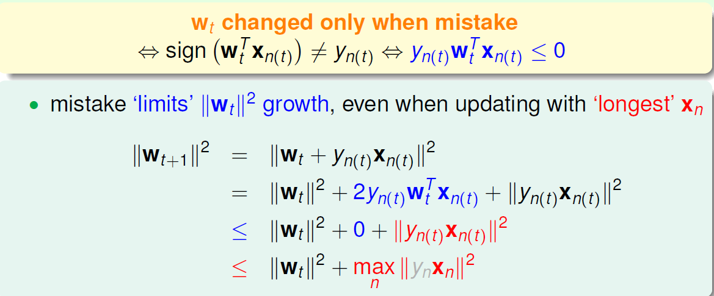
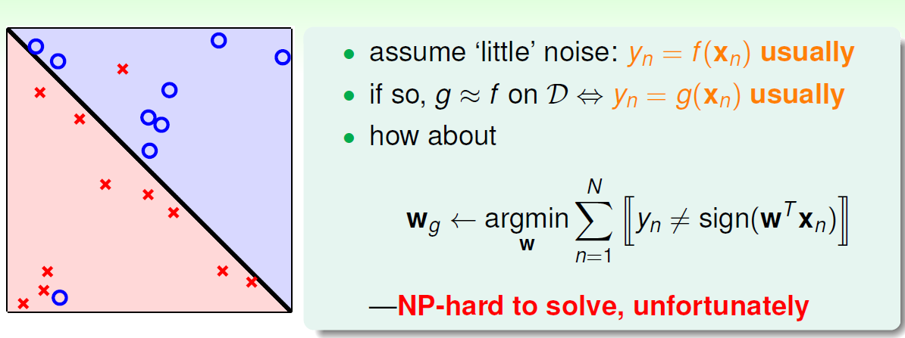
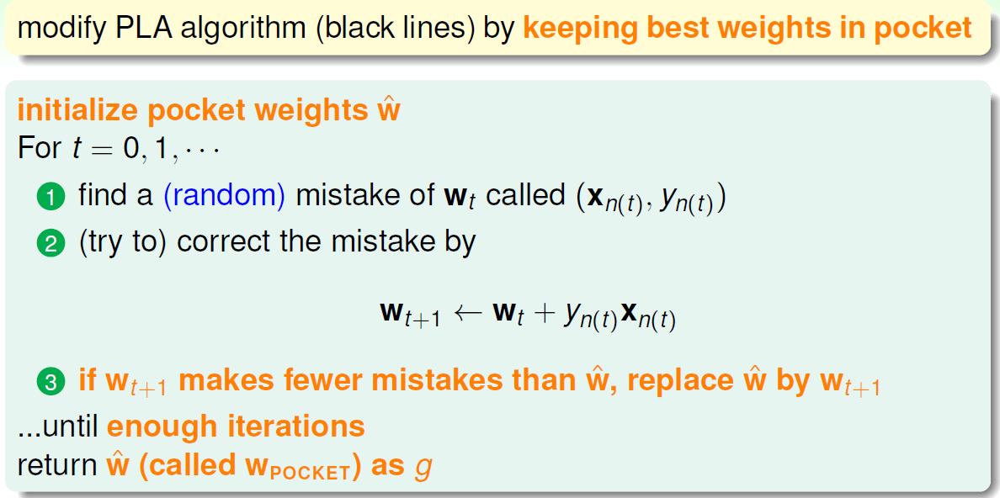

### Perceptron Hypothesis Set

## 引用上节课的例子

- 现在是有一个未知的function/他就是我们学习的目标
- 对应着这个function的是满足他的training examples
- 现在我们有很多hypothesis作为备选
- 选择一个学习算法进行使用
- 最后让我们的hypothesis的学习成果和function越接近越好
- 那么这个之后就引出我们要学的第一种hypothesis

 

## Perceptron-A simple hypothesis

- 在这里的age/annual salary等表示不同的特征/对应着$x_{i}$
- 对应的$w_{i}$表示这每一个特征对计算出来的值的影响
- threshold阈值
- $\sum_{i=1}^{d}w_{i}x_{i}$大于阈值:可以理解为+分类
- $\sum_{i=1}^{d}w_{i}x_{i}$小于阈值:可以理解为-分类

- 通过增加第0维/把阈值塞进去
- 写成了矩阵形式$w^{T}x$
- 那么接下来我们要了解/这个hypothesis到底长什么样子呢?

- 我们可以知道在一个二维的平面中/这些training data或者说这些特征是一些点
- 标签: +1/-1
- 在直观上,二维平面中我们的hypothesis就是一条线
- 而在更高的维度上的话/则是超平面
- 以二维平面而言/+1在线的一侧/-1在线的另一侧

## 怎么从hypothesis set中找到一个最优的g?

- 现在我们手中有无数个hypothesis
- 直观上来说就是在二维平面中有怎么找到一条线把不同类别的data分割开
- 做法就是/从一条随机的线开始
- 然后一次一次的去纠正这条线的错误

- 纠正的方法可以从向量的角度去解释
- 假设当前t时刻的y为+1
- 现在的$w^{T}_{t}x_{(t)}$是负数/说明这条线是有问题的
- 那么就让$w_{t+1}$ = $w_{t}+yx_{t}$
- 从图上来解释就是说/$w^{T}_{t}x_{(t)}$是负数通过模长*cos值的形式就能看出w和x的夹角大于九十度
- 而现在需要他的结果是正数/意味着需要拉小这个夹角
- 从$w_{t+1}$ = $w_{t}+yx_{t}$可以看出来我们把原来的$w_{t}$往小角度掰过来了/可以通过图直观的感受到

## PLA是怎么停下来的呢?

- 一定是需要data确实能被某个w彻底分开
- 这样的data是线性可分的

- 假设一个完美分开data的$w_{f}$
- 在PLA的算法中$w_{t}$会不断靠近$w_{f}$/要怎么去证明呢?
- 上一行公式:当判断正确的时候$y_{n}$的符号和$w^{T}_{f}x_{n}$一定是相同的/所以大于0/并且一定存在一个距离分割线最近的点
- 下一行公式:通过两个向量的内积的方法判断是否在靠近/值变大说明靠近了或者长度增大了
- 从公式中我们知道t+1轮的两个向量内积变大了
- 那么我们就得说明它长度增长不快或者不增长/就证明他在缩小了

- 我们都是有错才更新点/所以我们来观察错误的点
- 通过公式我们可以观察到:t+1轮的w的模长的增加和最远的点$x_{n}$有关/而这个值的增长并不快

## more about PLA

- 前面所有都是建立在这个data是线性可分的基础上
- 实际上我们并不知道一个数据集是否线性可分/也就是说有噪音数据的时候该怎么办

- 我们的终极目标是找到一个错误最少的$w_{g}$

- 没有完美的解决方法/那我们只能用一个口袋算法/类似于贪心/让这个效果尽可能的好
- 在这个算法中:实际就是根据之前的PLA不断迭代/当有犯错更少的w的时候就把它作为$w_{POCKET}$

