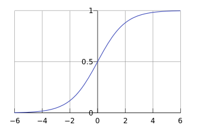

### 逻辑回归

## sigmoid函数

公式:$g(z)=\frac{1}{1+e^{-z}}$

图像:

- y的值在0~1之间/这样的函数十分有利于进行二分类问题的处理

## 逻辑回归的假设函数

- $g(z)=\frac{1}{1+e^{-z}}$
- $h_{\theta}(x)=g(\theta^{T}x)$

- 所以:$h_{\theta}=\frac{1}{1+e^{\theta^{T}x}}$ 

- $x$是输入/$\theta$是参数

## 逻辑回归的假设和损失函数

- 假设数据是符合伯努利分布的
- 假设我们有训练数据/也就是说我们可以知道类别为1和0的概率

$$
p(y=1|x,\theta) = h_{\theta}(x) \\
p(y=0|x,\theta) = 1-h_{\theta}(x)
$$

- 通过**极大似然估计**推导损失函数
- 把上述的两个公式合并/假设我们有数据的时候/那我们是知道y=1和y=0的后验概率的

$$
P(y|x,{\theta}) = h_{\theta}(x)^{y}(1-h_{\theta}(x))^{1-y}
$$

- 通过极大似然估计法反推出${\theta}$
- n个样本的概率相乘/越大说明当前的${\theta}$越好
- 所以根据这个意思我们可以得到极大似然估计的公式

$$
L({\theta}) = \prod_{i=1}^{n}p(y^{(i)}|x^{(i)},{\theta})=\prod_{i=1}^{n}h_{\theta}(x^{(i)})^{y^{(i)}}(1-h_{\theta}(x^{(i)}))^{1-y^{(i)}}
$$

- 然后取对数/变成累加

$$
L({\theta}) =\sum_{i=1}^{n}y^{(i)}ln(h_{\theta}(x^{(i)}))+({1-y^{(i)}})ln(1-h_{\theta}(x^{(i)})
$$

- 现在是要取最大值/而我们平常的cost代价函数习惯是最小值/所以取负数写成代价函数的形式

$$
J(h_{\theta}|y,{\theta}) = -yln(h_{\theta}(x)) - (1-y)ln(1-h_{\theta}(x))
$$

- 也可以写成

$$
J(h_{\theta}|y,{\theta}) =\left\{\begin{align}-yln(h_{\theta}(x), \\ - (1-y)ln(1-h_{\theta}(x));\end{align}\right.
$$

## 用梯度下降进行求解

- 梯度下降的迭代公式

$$
{\theta}_{j} = {\theta}_{j} - {\alpha}\frac{\partial J({\theta})}{\partial{\theta}_{j}}
$$

$$
\begin{align} \frac{\partial J(\theta)}{\partial \theta}  & = -\sum_{i=1}^n\left( y^{(i)}\frac{1}{h_\theta(x^{(i)};\theta)}\frac{\partial h_\theta(x^{(i)};\theta)}{\partial \theta}+(1-y^{(i)})\frac{1}{1-h_\theta(x^{(i)};\theta)}\frac{\partial (1-h_\theta(x^{(i)};\theta))}{\partial \theta}\right) \\  & = -\sum_{i=1}^n\frac{1}{h_\theta(x^{(i)};\theta)}\left( \frac{y^{(i)}}{h_\theta(x^{(i)};\theta)}-\frac{1-y^{(i)}}{1-h_\theta(x^{(i)};\theta)}  \right) \\  &=-\sum_{i=1}^n x^{(i)}h_\theta(x^{(i)};\theta)(1-h_\theta(x^{(i)};\theta)) \left( \frac{y^{(i)}}{h_\theta(x^{(i)};\theta)}-\frac{1-y^{(i)}}{1-h_\theta(x^{(i)};\theta)}  \right) \\  & = -\sum_{i=1}^n x^{(i)}\left(y^{(i)}(1-h_\theta(x^{(i)};\theta))-(1-y^{(i)})h_\theta(x^{(i)};\theta))  \right) \\  &= \sum_{i=1}^n \left( y^{(i)}-h_\theta(x^{(i)};\theta) \right)x^{(i)} \\ \end{align}
$$

- 再回代到梯度下降公式即可!

## 优缺点

- 优点:
  - 直接简单/容易解释/不同的特征的权重对最后模型的效果有直接的影响
  - 除了简单的分类之外/还可以得到概率
- 缺点:
  - 比较简单的模型难以拟合复杂的数据分布