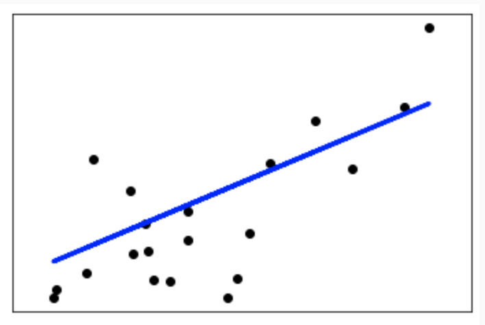
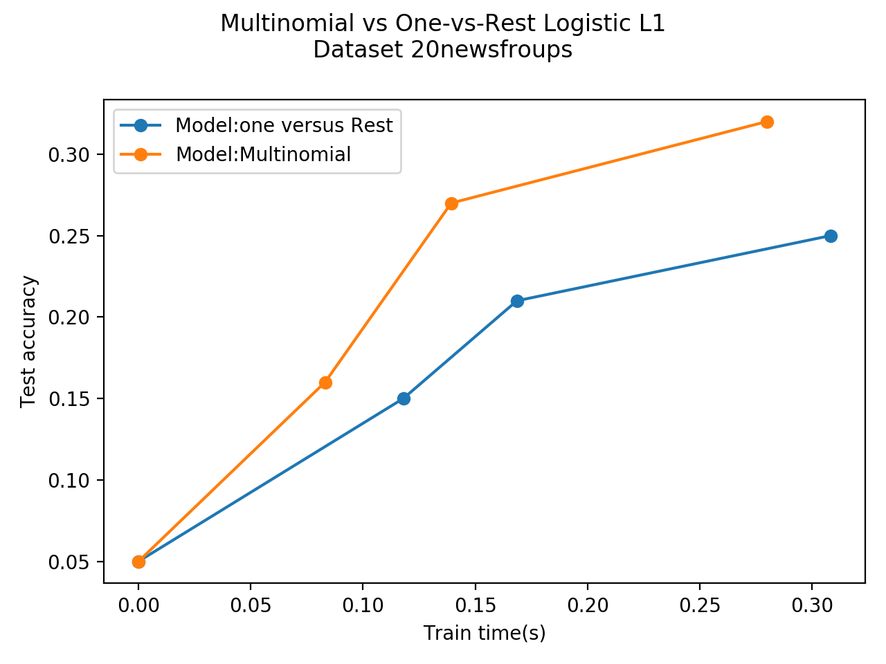
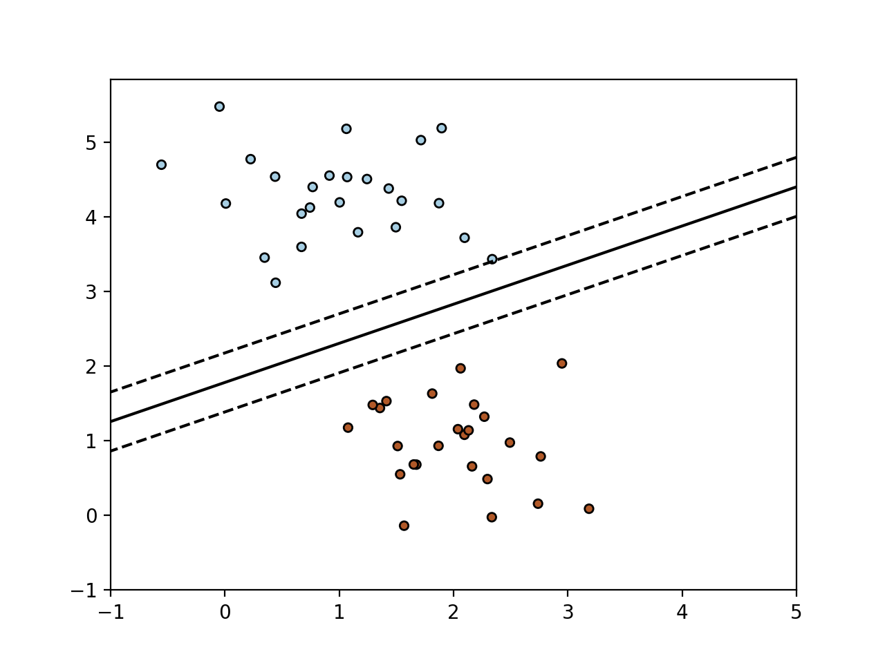

### Linear Regression 线性回归例子

```python
import matplotlib.pyplot as plt
import numpy as np
from sklearn import datasets,linear_model
from sklearn.metrics import mean_squared_error,r2_score

# 加载diabetes数据集
diabetes_X,diabetes_y = datasets.load_diabetes(return_X_y=True)

# 只用一个特征
diabetes_X = diabetes_X[:,np.newaxis,2]

# 分割训练集和测试集
diabetes_X_train = diabetes_X[:-20]
diabetes_X_test = diabetes_X[-20:]

# 分割训练集和测试集的标签
diabetes_y_train = diabetes_y[:-20]
diabetes_y_test = diabetes_y[-20:]

# 线性回归对象
regr = linear_model.LinearRegression()

# 用训练集训练模型
regr.fit(diabetes_X_train,diabetes_y_train)

# 在测试集上预测
diabetes_y_pred = regr.predict(diabetes_X_test)

# 系数
print('Coefficients:\n',regr.coef_)
# 均方误差
print('Mean squared error:%.2f'%mean_squared_error(diabetes_y_test,diabetes_y_pred))
# 系数的误差 /1是最好的
print('Coefficient of determination:%.2f'%r2_score(diabetes_y_test,diabetes_y_pred))

# %%
# 画图
plt.scatter(diabetes_X_test,diabetes_y_test,color='black')
plt.plot(diabetes_X_test,diabetes_y_pred,color='blue',linewidth=3)

plt.xticks(())
plt.yticks(())
plt.show()
# %%
```
\>>>
<br/>
Coefficients:[938.23786125]
<br/>
Mean squared error:2548.07
<br/>
Coefficient of determination:0.47



### 岭回归

```python
# %%
from sklearn import linear_model
reg = linear_model.Ridge(alpha=.5)
reg.fit([[0,0],[0,0],[1,1]],[0,.1,1])
>>>Ridge(alpha=0.5, copy_X=True, fit_intercept=True, max_iter=None,
      normalize=False, random_state=None, solver='auto', tol=0.001)

reg.coef_
>>>array([0.34545455, 0.34545455])

reg.intercept_
>>>0.13636363636363638
# %%
```

### 20newgroups上的多类稀疏Logistic回归
```python
import timeit
import warnings

import matplotlib.pyplot as plt
import numpy as np

from sklearn.datasets import fetch_20newsgroups_vectorized
from sklearn.linear_model import LogisticRegression
from sklearn.model_selection import train_test_split
from sklearn.exceptions import ConvergenceWarning

warnings.filterwarnings('ignore',category=ConvergenceWarning,module='sklearn')
t0 = timeit.default_timer()

# we use SAGA solver
solver = 'saga'

# Tunrn down for fater run time
n_samples = 1000

X,y = fetch_20newsgroups_vectorized('all',return_X_y=True)
X = X[:n_samples]
y = y[:n_samples]
# print(X.shape,y.shape) - (1000,130107) / (1000,)

X_train,X_test,y_train,y_test = train_test_split(X,y,random_state=42,stratify=y,test_size=0.1)

train_samples,n_features = X_train.shape
# print(train_samples) - 900
# print(n_features) - 130107
n_classes = np.unique(y).shape[0]
# print(n_classes) - 20

models = {'ovr':{'name':'one versus Rest', 'iters':[1,2,4]},
          'multinomial':{'name':'Multinomial','iters':[1,3,7]}}

for model in models:
    # add initial chance-level values for plotting purpose
    accuracies = [1 / n_classes]
    times = [0]
    densities = [1]

    model_params = models[model]

    # Small number of epochs for fast runtime
    for this_max_iter in model_params['iters']:
        print('[model=%s ,solver=%s] Number of epochs: %s'%
              (model_params['name'], solver,this_max_iter))
        lr = LogisticRegression(solver=solver,
                                multi_class=model,
                                penalty='l1',
                                max_iter=this_max_iter,
                                random_state=42,)
        t1 = timeit.default_timer()
        lr.fit(X_train,y_train)
        train_time = timeit.default_timer() - t1

        y_pred = lr.predict(X_test)
        accuracy = np.sum(y_pred == y_test) / y_test.shape[0]
        density = np.mean(lr.coef_ != 0,axis=1)*100
        accuracies.append(accuracy)
        densities.append(density)
        times.append(train_time)
    models[model]['times'] = times
    models[model]['desities'] = densities
    models[model]['accuracies'] = accuracies
    print('Test accuracy for model %s: %s.4f'%(model,accuracies[-1]))
    print('%% non-zero coefficients for model %s,'
          'per class:\n%s'%(model,densities[-1]))
    print('Run time(%i epochs) for model %s:'
          '%.2f' %(model_params['iters'][-1],model,times[-1]))

fig = plt.figure()
ax = fig.add_subplot(111)

for model in models:
    name = models[model]['name']
    times = models[model]['times']
    accuracies = models[model]['accuracies']
    ax.plot(times,accuracies,marker='o',
            label='Model:%s'%name)
    ax.set_xlabel('Train time(s)')
    ax.set_ylabel('Test accuracy')
ax.legend()
fig.suptitle('Multinomial vs One-vs-Rest Logistic L1\n'
             'Dataset %s'%'20newsfroups')
fig.tight_layout()
fig.subplots_adjust(top=0.85)
run_time = timeit.default_timer()-t0
print('Example run in %.3f s'%run_time)
plt.show()
```
```
[model=one versus Rest ,solver=saga] Number of epochs: 1
[model=one versus Rest ,solver=saga] Number of epochs: 2
[model=one versus Rest ,solver=saga] Number of epochs: 4
Test accuracy for model ovr: 0.25.4f
% non-zero coefficients for model ovr,per class:
[0.01383477 0.05303327 0.01076037 0.00691738 0.01076037 0.02075215
 0.0430415  0.01229757 0.02075215 0.02075215 0.02382654 0.00999178
 0.00922318 0.03535552 0.09453757 0.04457869 0.11759552 0.01152897
 0.00384299 0.00461159]
Run time(4 epochs) for model ovr:0.31
[model=Multinomial ,solver=saga] Number of epochs: 1
[model=Multinomial ,solver=saga] Number of epochs: 3
[model=Multinomial ,solver=saga] Number of epochs: 7
Test accuracy for model multinomial: 0.32.4f
% non-zero coefficients for model multinomial,per class:
[0.00999178 0.00614879 0.01383477 0.00230579 0.00691738 0.00614879
 0.00845458 0.00384299 0.00768598 0.00845458 0.01076037 0.00691738
 0.0015372  0.01076037 0.00768598 0.01076037 0.00691738 0.00768598
 0.00230579 0.00384299]
Run time(7 epochs) for model multinomial:0.28
Example run in 1.944 s
```


### SGD:Maximum margin separating hyperplane
```python
import numpy as np
import matplotlib.pyplot as plt
from sklearn.linear_model import SGDClassifier
from sklearn.datasets import make_blobs

X,Y = make_blobs(n_samples = 50,centers = 2,random_state=0,cluster_std=0.60)

clf = SGDClassifier(loss='hinge',alpha=0.01,max_iter=200)

clf.fit(X,Y)

# plot the line, the points,and the nearest vectors to the plane
xx = np.linspace(-1,5,10)
yy = np.linspace(-1,5,10)

X1,X2 = np.meshgrid(xx,yy)
Z = np.empty(X1.shape)
for (i,j),val in np.ndenumerate(X1):
    x1 = val
    x2 = X2[i,j]
    p = clf.decision_function([[x1,x2]])
    Z[i,j] = p[0]

levels = [-1.0,0.0,1.0]
linestyles = ['dashed','solid','dashed']
colors = 'k'
plt.contour(X1,X2,Z,levels,colors=colors,linestyles=linestyles)
plt.scatter(X[:,0],X[:,1],c=Y,cmap=plt.cm.Paired,edgecolors='black',s=20)
plt.axis('tight')
plt.show()
```
\>>>
