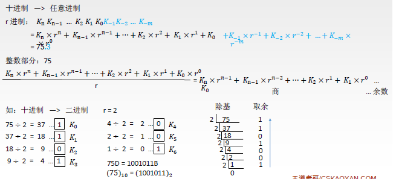
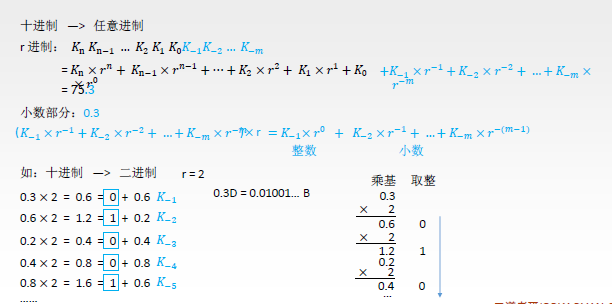
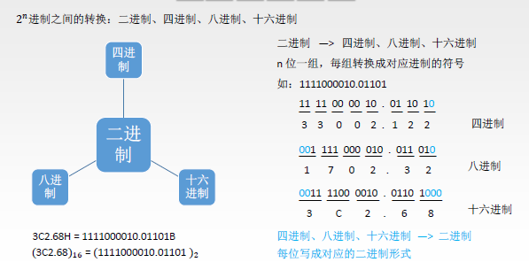

> ### 进位计数法

- 
- 进制转换
  - 转换成十进制
  - 
  - 转换成二进制
  - 
  - 十进制转化成二进制或任何进制
  - 
  - 
  - 上图中 把小数部分每次x r，有整数就取整为1，一直到最后得到1为止。
  - 二进制向四进制、八进制、十六进制转化
  - 
- 真值和机器数
  - +15 -> **0** 1111  / -8 -> **1** 1000
  - 把符号数字化

 

> ### BCD码

 

> ### 字符和字符串

