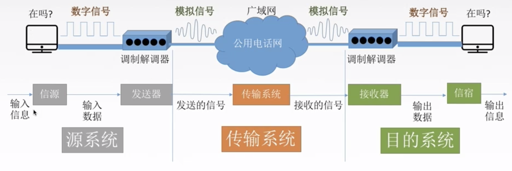
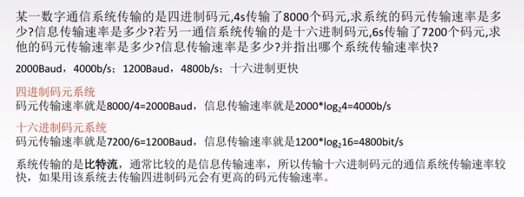
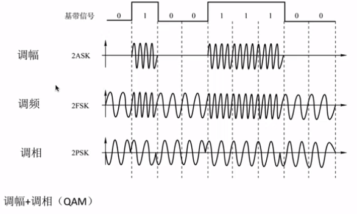

> ### 物理层基本概念

- 物理层解决如何在连接各种计算机的传输媒体上**传输数据比特流**，而不是具体的传输媒体。
- 主要任务：确定与传输媒体**接口**有关的一些特性。-定义标准
- 特性
  - 机械特性：定义物理连接的特性，规定物理连接时所采用的规格、接口形状、引线数目、引脚数量和排列情况
  - 电气特性：规定传输二进制时，线路上信号的**电压范围**、阻抗匹配、传输速率和距离限制等。
  - 功能特性：指明某条线上出现的某一**电平表示何种意义**，接口部件的信号线的用途。
  - 规程特性：（过程特性）定义各条物理线路的工作**规程和时序**关系

 

> ### 数据通信基础知识

相关术语

- 通信的目的是**传递信息**
- **数据**：传送信息的实体，通常是有意义的符号序列
- **信号**：数据的电气/电磁表现，是数据在传输过程中的存在形式。
  - 数字信号：代表消息的参数取值是离散的。
  - 模拟信号：代表消息的参数取值是连续的。
- **信源**：产生和发送数据的源头。
- **信宿**：接受数据的终点。
- **信道**：信号的传输媒介。一般用来表示向某一个方向传送信息的介质，因此一条通信线路往往包含一条发送信道和一条接受信道。

 

**三种通信方式**

- 单工通信：只有一个方向的通信而没有反方向的交互，只需要一条信道。
- 半双工通信：通信的双方都可以发送或接受信息，但任何一方都不能同时发送和接收，需要两条信道。
- 双工通信：通信双方可以同时发送和接受信息，也需要两条信道。

 

**两种数据传输方式**

- 串行传输
  - 速度慢，费用低，适合远距离
- 并行传输
  - 速度快，费用高，适合近距离

 

> ### 码元 波特 速率 带宽

**码元**：是指一个**固定时长**的**信号波形**。代表不同离散数值的基本波形，是数字通信中数字信号的计量单位，这个时长内的信号称为k进制码元，而该时长称为码元宽度。当码元的离散状态有M个时，此时码元为M进制码元。

- 1码元可携带多个比特信息量。例如，在使用二进制编码时，只有两种不同的码元，一种代表0状态，另一种代表1状态。
- k进制码元
  - 4进制码元
  - 码元的离散状态有4个
  - 4种高低不同的信号波形 00 01 10 11 

**速率**：也叫数据率，是指数据的**传输速率**，表示单位时间内传输的数据量。可以用**码元传输速率**和**信息传输速率**表示。

- 码元传输速率：别名码元速率，表示单位时间内数字通信系统所传输的码元个数，单位是**波特**（Baud）。**1波特表示数字通信系统每秒传输一个码元。**
  - 这里的码元可以是多进制，也可以是二进制，但码元速率与进制数无关。
  - 同样是五个码元 比特数目不同
- 信息传输速率：比特率，表示单位时间内数字通信系统传输的二进制码元个数（即比特数），单位比特/秒（b/s）
  - 关系：若一个码元携带nbit的信息量，则M Baud的码元传输速率所对应的信息传输速率为Mxn bit/s
- 不同：
  - 码元传输速率：1s传输多少个码元
  - 信息传输速率：1s传输多少个比特

 

**带宽**：表示在单位时间内从网络中的某一点到另一点所能通过的**最高数据率**，常用来表示网络的通信线路所能传输数据的能力，单位是b/s。   

 

> ### 编码和调制

- **基带信号**：将数字信号1和0直接用两种不同的电压表示，再送到**数字信道**上去传输（基带传输）。来自信源的信号，像计算机输入的代表各种文字或图像文件的数据信号都属于基带信号。基带信号就是发出的**直接表达了要传输的信息的信号**，比如声波
- **宽带信号**：将基带信号进行调制后形成的频分复用模拟信号，再传送到模拟信道上传输。吧基带信号经过载波调制后，把信号的频率范围搬移到**较高的频段**以便在信道中传输。
- 在传输距离近的时候，计算机网络采用**基带传输**方式（近距离衰减小，从而信号内容不容易发生变化）
- 在传输距离远的时候，计算机网络采用**宽带传输**方式（远距离衰减大，即使信号变化大也能最后过滤出来基带信号）
- 

 

> ### 数字数据编码为数字信号

- 非归零编码（高1低0）：编码容易实现，但没有检错功能且无法判断一个码元的开始和结束，以至于收发双方难以保持同步。
- 归零编码：信号电平在一个码元之内都要恢复到零的这种编码成编码方式。
  - 
- 反向不归零编码：信号电平反转表示0，信号电平不变表示1。
  - 
- 曼彻斯特编码：将一个码元分成两个相等的间隔，前一个间隔为低电平后一个间隔为高电平表示码元1。码元0则正好相反。也可以采用相反的规定。该编码的特点是在每一个码元的中间出现电平跳变，位中间的跳变既作时钟信号（可用于同步），又作数据信号，但它所占的频带宽度是原始的基带宽度的两倍。 
- 差分曼彻斯特编码（同1异0）：常用局域网传输，规则是若码元为1，则前半个码元的电平与上一个码元的后半个码元的电平相同。若是0则相反。该编码的特点是，在每个码元中间都有一次电平的跳转，可以实现自同步，且抗干扰性强于曼彻斯特编码。
- 4B/5B编码：比特流中插入额外的比特以打破一连串的0或1，就是用5个比特来编码4个比特的数据，之后再传给接收方，因此称为4B/5B。编码效率为80%。

 

> ### 数字数据调制为模拟信号

- 数字数据调制技术在发送端将数字信号转换为模拟信号，而在接收端将模拟信号还原为数字信号，分别对应于调制解调器的调制和解调过程。

- 

 

> ### 模拟数据编码为数字信号

- 计算机内部处理的是二进制数据，处理的都是数字音频，所以需要将模拟音频通过采样、量化转换成有限个数字表示的离散序列。
- 对音频信号进行编码的脉码调制PCM，三个步骤：抽样、量化、编码。
  - 抽样：对模拟信号周期性扫描，把时间上连续的信号变成时间上离散的信号。为了使所得的离散信号能无失真地代表被抽样的模拟数据，要使用采样定理进行采样：f采样频率 ≥ 2f信号最高频率
  - 量化：把抽样取得的电平幅值按照一定的分级标度转化为对应的数字值，并取整数，这就把连续的电平幅值转化为离散的数字量。 
  - 编码：把量化的结果转换为与之对应的二进制编码。

 

> ### 模拟数据调制为模拟信号

- 为了试验传输的有效性，可能需要较高的频率。这种调制方式还可以使用频分复用技术，充分利用带宽资源。在电话机和本地交换机所传输的信号是采用模拟信号传输模拟数据的方式。模拟的声音数据是加载到模拟的载波信号中传输的。