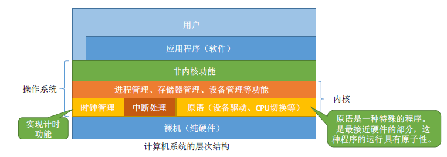
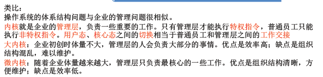
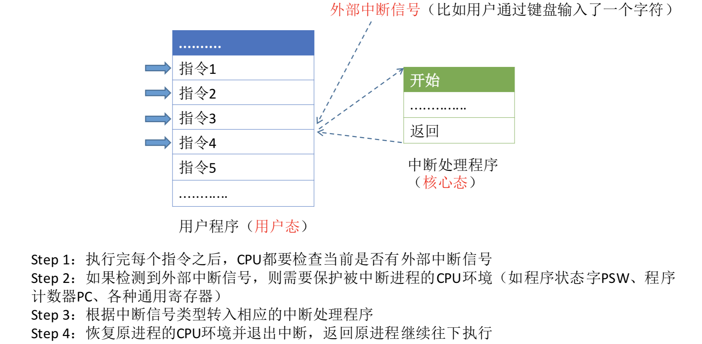

> ### 运行机制和体系结构

- 
- **指令**：处理器能识别和执行的最基本命令。
  - 如：加法指令进行加法运算
  - **特权指令**：内存清零指令（不允许用户程序使用）
  - **非特权指令**：普通的运算
- **处理器的状态**：用程序状态字寄存器（PSW）中的某标志位来标识当前处理器处于什么状态。如0标识用户态。
  - 用户态（目态）：CPU只能执行非特权指令
  - 核心态（管态）：特权指令可以执行

- **程序**
  - 内核程序：是系统的管理者，既可以执行特权指令，也可以执行非特权指令，运行在核心态。
  - 应用程序：为保证系统能安全运行，普通应用程序只能执行非特权指令，运行在用户态。

 

> ### 操作系统内核

- 
- **内核**：计算机上配置的底层软件，是操作系统最基本最核心的部分。
  - 实现操作系统内核功能的哪些程序就是**内核程序**
  - 
- 操作系统的体系结构
  - 大内核：将操作系统的主要功能模块都作为系统内核，运行在核心态
    - 优点：高性能
    - 缺点：内核代码庞大，结构混乱，难以维护
  - 微内核：只把最基本的功能保留在内核
    - 优点：内核功能少，结构清晰，方便维护
    - 缺点：需要频繁地在核心态和用户态之间切换，性能低
  - 

 

> ### 中断和异常

- 引入中断机制，实现了多到程序并发执行本质：发生中断意味着需要操作系统介入，开展管理工作。
- 中断的一些概念
  - 中断发生时，CPU立刻进入核心态
  - 中断发生后，当前运行的进程暂停运行，并由操作系统内核对中断进行处理
  - 对于不同的中断信号，会进行不同的处理
  - 反正中断后，就需要操作系统介入，开展管理工作。由于进程切换，分配I/O设备需要特权指令，因此CPU需要从用户态转为核心态。**中断可以使CPU从用户态切换为核心态，使操作系统获得计算机的控制权。**
  - 
  - 
  - 
- **外中断的处理**
  - 
- 