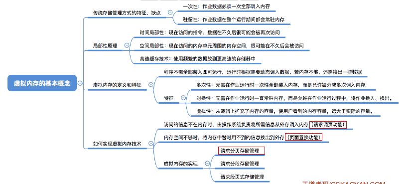
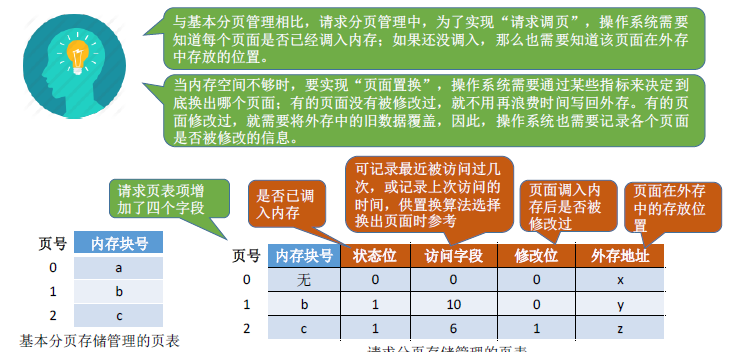
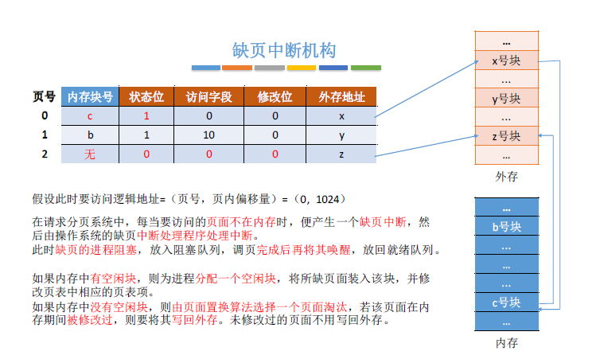
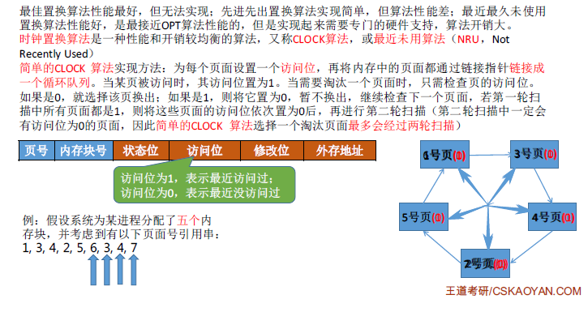
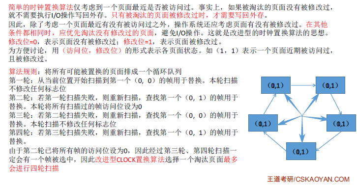
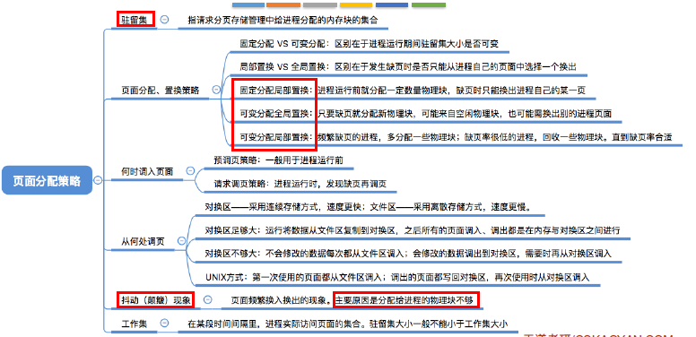

> ### 虚拟内存的基本概念

- 
- 传统存储管理（很多暂时用不到的数据也会长期占用内存，导致内存利用率不高）
  - 连续分配
    - 单一连续分配
    - 固定分区分配
    - 动态分区分配
  - 非连续分配
    - 基本分页存储管理
    - 基本分段存储管理
    - 基本段页式存储管理
- 虚拟存储技术解决的问题
  - 一次性：作业必须一次性全部装入内存后才能运行
  - 驻留性：一旦作业装入内存，就会一直驻留在内存中，直到作业运行结束。
- 局部性原理
  - 时间局部性：如果执行了程序中的某条指令，那么不久后这条指令很可能再次被执行。如果某个数据被访问过，不久后 该数据很可能再次被访问。
  - 空间局部性：一旦程序访问了某个存储单元，不久后其附近的存储单元也很可能被访问。
- 虚拟内存的定义和特征
  - 基于局部性原理，在程序装入可以将程序中很快会用到的部分装入内存，暂时用不到的部分留在外存，就可以让程序开始执行。
  - 在程序执行过程中，当所访问的信息不再内存，由操作系统负责将所需要信息从外存调度到内存，然后继续执行程序
  - 若内存空间不够，由操作系统负责把内存中暂时用不到的信息换出到外存。
  - 操作系统的管理下，在用户看来似乎有一个比实际内存大得多的内存，这就是虚拟内存
  - 
  - 三个特征
    - 多次性：无需在作业运行时一次性全部装入内存，而是允许被分成多次调入内存
    - 对换性：在作业运行时无需一直常驻内存，而是允许在作业二运行过程中，把作业换入换出
    - 虚拟性：从逻辑上扩充了内存的容量，让用户看到的内存容量，大于实际的容量
- 如何实现虚拟内存技术
  - 允许一个作业分多次调入内存。如果采用连续分配方式，会不方便实现。因此虚拟内存的实现需要建立在离散分配的内存管理方式基础上。
  - 虚拟内存的实现
    - 请求分页存储管理
    - 请求分段存储管理
    - 请求段页式存储管理

 

> ### 请求分页管理方式

- 
- 页表机制
  - 
- 缺页中断机构
  - 
- 地址变换机构
  - 

 

> ### 页面置换算法

- 请求分页存储管理与基本分页存储管理的区别
  - 当访问的信息不在内存时，操作系统负责把所需信息从外存调入内存，然后继续执行程序
  - 内存不够，操作系统负责把内存中暂时用不到的信息换出外存
- 最佳置换算法
  - 
  - 每次选择淘汰的页面将是以后永不使用的，或者在最长时间内不再被访问的页面，这样可以保证最低的缺页率
- 先进先出置换算法（FIFO）
  - 
  - Belady异常：当为进程分配的物理块数增大，却也次数不减反增的异常现象
- 最近最久未使用置换算法（LRU）
  - 
- 时钟置换算法（CLOCK）
  - 
- 改进型的时钟置换算法
  - 
- 对比
  - 

> ### 页面分配策略

- 
- 驻留集：指请求分页存储管理中给进程分配的物理块的集合
- 固定分配：操作系统为每个进程分配一组固定数目的物理块，整个运行过程不变。
  - 缺点：很难在一开始确定每个进程分配多少物理块，太少会频繁出现缺页中断
- 可变分配全局：某进程发生缺页，系统从空闲物理块队列中取出一个物理块分配给进程。
  - 更灵活但是盲目增加物理块会导致并发能力下降
- 可变分配局部：当频繁缺页的时候才分配物理块，直到缺页率趋于适度。反之，缺页率很低，适当减少物理块。
  - 在动态调动页面的同时，保持了系统的多道程序并发能力。
- 调入页面的时机
  - 预调页策略：这种策略主要用于进程的首次调入
  - 请求调页策略：进程在运行期间发现缺页才将所缺页面调入内存。I/O开销较大
- 从哪里调入页面
  - 
- 抖动现象：刚换出的页面马上又要换入内存，反之也是。
  - 产生原因：进程频繁访问的页面数目高于可用的物理块数（物理块不够了！）
- 工作集
  - 