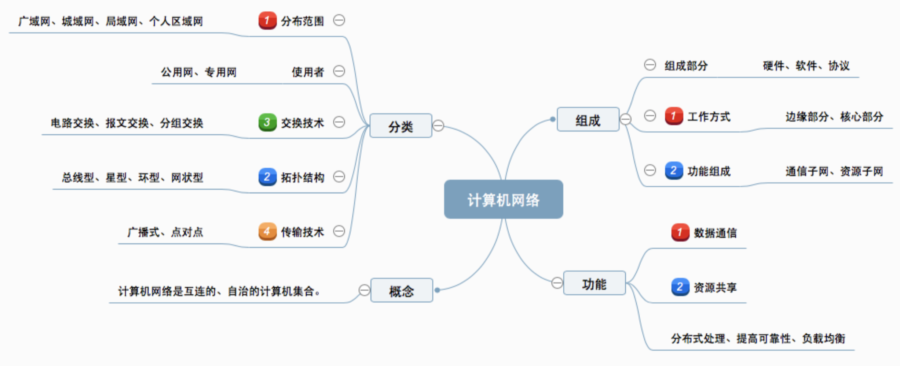
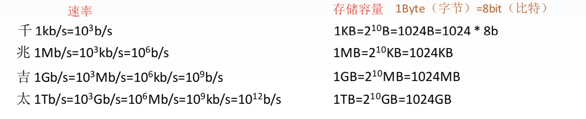

> ### 计算机网络的概念

- 计算机网络：是一个将分散的/具有独立功能的**计算机系统**，通过**通信设备**和**线路**连接起来的，由功能完善的**软件**实现**资源共享**和**信息传递**的系统。

- 计算机网络是**互连**的/**自治**的计算机集合。

 

> ### 计算机网络的功能

- **数据通信**(连通性):微信/qq

- **资源共享**:硬件-打印机/软件/数据-百度文库

- **分布式处理**:多台计算机各自承担同一工作任务的不同部分-Hadoop

- **提高可靠性**:宕机-替代机

- **负载均衡**:各计算机更亲密

 

> ### 计算机网络的组成

- **组成部分**：硬件/软件/协议
- **工作方式**
  - 边缘部分：用户直接使用
    - C/S方式
    - P2P方式
  - 核心部分：为边缘部分服务
- **功能组成**：数据通信/资源共享
  - 通信子网：实现**数据通信**
    - 应用层
    - 表示层
    - 会话层
  - 资源子网：实现**资源共享**
    - 传输层（上下子网的接口）
    - 网络层：路由器
    - 数据链路层：交换机/网桥
    - 物理层：集线器/中继器

 

> ### 计算机网络的分类

- 按分布范围
  - 广域网WAN
  - 城域网MAN
  - 局域网LAN
  - 个人区域网PAN
- 按使用者
  - 公用网 电信
  - 专用网 军队 
- 按交换技术
  - 电路交换
  - 报文交换
  - 分组交换
- 按拓扑结构
  - 总线型
  - 星型 有一个中心节点
  - 环型
  - 网状型 广域网
- 按传输技术
  - 广播式网络：共享公共通信信道
  - 点对点网络：使用**分组存储转发**和**路由选择**机制

 

> ### 标准化工作

- **标准的分类**
  - 法定标准：有权威机构指定的/合法的标准/OSI
  - 事实标准：某些公司的产品在竞争中成为主流/TCP/IP
- RFC(Request For Comments):英特网标准的形成
- RFC要上升为因特网的正式标准的四个阶段
  - 因特网草案：这个阶段还不是RFC文档
  - 建议标准：从这个阶段开始成为RFC文档
  - 草案标准：IETF/IAB
  - 因特网标准

 

> ### 标准化工作的相关组织

- 国际标准化组织ISO
  - OSI参考模型/HDLC协议
- 国际电信联盟ITU
  - 制定通信规则
- 国际电气电子工程师协会IEEE
  - 学术机构
  - IEEE802系列标准
  - 5G
- Internet工程任务组IETF
  - 因特网相关标准
  - RFC XX

 

> ### 速率/带宽/吞吐量

- 速率：**数据率**或**数据传输率**或**比特率**

  - 比特 连接在计算机网络上的主机在数字信道上传送数据位数的速率
  - 单位b/s kb/s Mb/s Gb/s
  - 

- 带宽：表述网络的通信线路传送数据的能力，通常指单位时间内从网络中的某一点到另外一点所能通过的“**最高数据率**”

  - 单位：b/s kb/s ...
  - 比如百兆网卡： 100mb/s  **网络设备所支持的最高速度**

- 吞吐量：表示单位时间内通过某个网络的数据量
  
  - 单位b/s kb/s
  - 吞吐量受到网络的带宽或网络的额定速率限制
  

 

> ### 时延/时延带宽积/往返时间RTT/利用率

- 时延：数据/报文/分组/比特流从网络的一端传送到另一端所需要的时间。也叫**延迟**。单位s
  - 发送时延
  - 传播时延
  - 排队时延
  - 处理时延
  - 
- 时延带宽积bit = 传播时延s X 带宽b/s
  - 又称为**比特为单位的链路长度**/**某段链路现在的容量**
- 往返时延RTT：从发送方发送数据开始，到发送方收到接收方的确认（接收方收到数据后立即发送确认），总共经历的时延。
  - RTT越大/在收到确认之前，可发送的数据越多
  - RTT
    - 往返传播时延 = 传播时延 x 2
    - 末端处理时间
- 利用率
  - 信道利用率： 有数据通过的时间/（有+无）数据通过时间
  - 网络利用率：信道利用率加权平均值 

