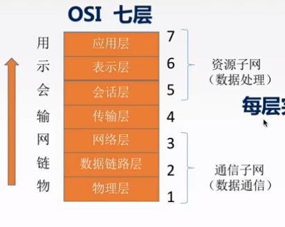
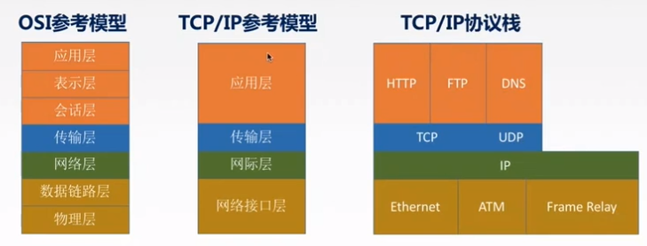
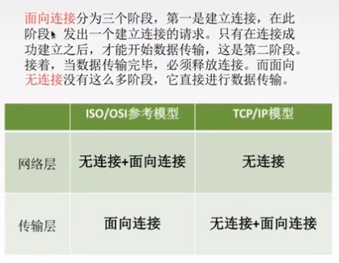
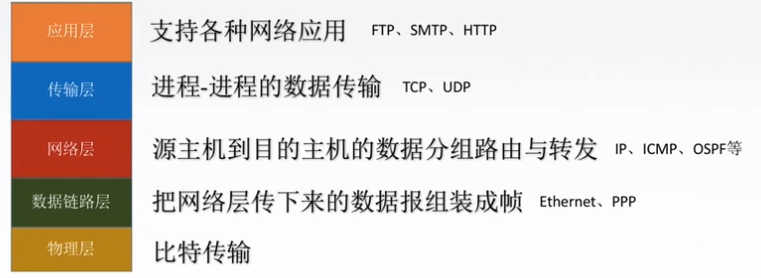
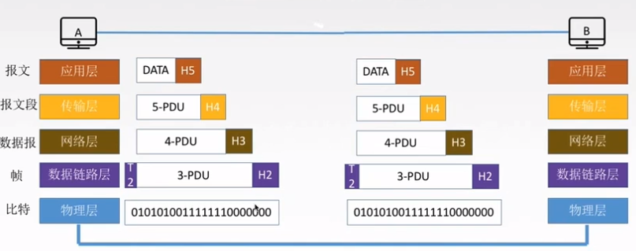

> ### 分层/协议/接口/服务

- **分层**：计算机网络体系结构简称网络体系结构是**分层结构**。
-  **协议**：就是规则的集合。在网络中要做到有条不紊地交换数据，就必须遵循一些事先约定好的规则。
- **接口**：是同一节点内相邻两层间交换信息的连接点，是一个系统内部的规定。
- **服务**：是指下层为紧邻的上层提供的功能调用。

 

> ### OSI参考模型

- 目的：支持**异构网络系统**的互联互通。（开放）
- 
- ISO/OSI参考模型解释通信过程
  - 
- **应用层**：用户与**网络**的界面/所有能和用户交互产生**网络流量**的程序。
  - 典型应用层服务
    - 文件传输（FTP）
    - 电子邮件（SMTP）
    - 万维网（HTTP） 
- **表示层**：用于处理在两个通信系统中交换信息的表达方式（语法和语义）
  - 功能一：数据格式变换-翻译官
  - 功能二：数据加密解密 -防抓包
  - 功能三：数据压缩和恢复
- **会话层**：向**表示层**实体/用户进程提供建立连接并在连接上**有序传输**数据。这叫做会话，也叫**建立同步**。
  - 特点：彼此独立不相互影响
  - 功能一：建立/管理/终止会话
  - 功能二：使用检验点可以使会话在通信失效时从校验点/同步点继续恢复通信，实现数据同步。
    - 传输大文件 中途失效的时候-在靠近校验点的位置重新传输
    - 主要协议：ADSP/ASP
- **传输层**：负责主机中**两个进程**的通信/**端到端**的通信。（只管目的地）传输单位是报文段或用户数据报
  - 功能一：**可**靠传输/不可靠传输
  - 功能二：**差**错控制
  - 功能三：**流**量控制
  - 功能四：复**用**分用 
    - 复用：多个应用层进程可同时使用下面运输层的服务。
    - 分用：运输层把收到的信息分别交付给上面应用层中相应的进程。
  - 协议：TCP/UDP

- **网络层**：主要任务是把分组从源端传到目的端，为分组交换网上的不同主机提供通信服务。网络层传输单位是**数据报**。
  - 功能一：路由选择
  - 功能二：流量控制 发送端 
  - 功能三：差错控制
  - 功能四：拥塞控制
  - 协议：IP/IPX/ICMP/IGMP/ARP/RARP/OSPF
- **数据链路层**：主要任务是把网络层传下来的数据报**组装成帧**。数据链路层/链路层的传输单位是帧。
  - 功能一：成帧（定义帧的开始和结束）
  - 功能二：差错控制 帧错+位错
  - 功能三：流量控制
  - 功能四：访问（接入）控制 控制对信道的访问
  - 协议：SDLC/HDLC/PPP/STP
- **物理层**：主要任务是在**物理媒体**上实现比特流的透明传输。物理层传输单位是**比特**。
  - 透明传输：指不管所传数据是什么样的比特组合/都应当能够在链路上传送。
  - 功能一：定义接口特性
  - 功能二：定义传输模式 单工/半双工/双工
  - 功能三：定义传输速率
  - 功能四：比特同步
  - 功能五：比特编码
  - 协议：Rj45 802.3

 

> ### TCP/IP模型&OSI参考模型

- 
- 相同点
  - 都分层
  - 基于独立的协议栈的概念
  - 可以实现异构网络互联
- 不同点
  - OSI定义三点：服务/协议/接口
  - OSI先出现，参考模型先于协议发明，不偏向特定协议
  - TCP/IP设计之初就考虑到异构网互联问题，把IP作为重要层次
  - 

 

> ### 5层参考模型

- 综合OSI和TCP/IP的优点
- 
- 5层参考模型的数据封装与解封装
- 