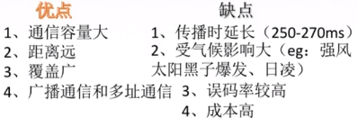

> ### 传输介质及分类

- 传输介质也称传输媒体/传输媒介，他就是数据传输系统中发送设备和接收设备之间的**物理通路**。
- **传输媒体并不是物理层**
  - 传输媒体在物理层的下面，因为物理层是体系结构的第一层，因此有时称传输媒体为0层。在传输媒体中的是信号，但传输媒体并不知道所传输的信号代表什么意思。但物理层规定了**电气特性**，因此能够识别所传送的比特流。
- **传输介质**
  - 导向性传输介质：电磁波被导向沿着固体媒介（铜线/光钎）传播。
    - 双绞线：古老又常见的传输介质，两根绞合又相互绝缘的铜导线组成。
      - 绞合可以减少相邻导线的电磁干扰
      - 为了进一步提高电磁干扰能力，可以加上一个金属丝变质的屏蔽层，这就是屏蔽双绞线。
      - 模拟传输和数字传输都可以使用双绞线，通信距离一般为几十公里。距离太远时，对于模拟传输，要用放大器放大衰弱的信号。对于数字传输，要用中继器将是真的信号整形。
    - 同轴电缆：由导体铜质芯线，绝缘层，网状编制屏蔽层和塑料外层构成。
      - 基带同轴电缆：局域网中广泛使用
      - 宽带同轴电缆：有线电视系统
    - 对比：由于外导体屏蔽层的作用，同轴电缆**抗干扰特性**比双绞线好，被广泛用于传输较高速率的数据，其传输距离更远，但价格较双绞线贵。
    - 光纤：利用光导纤维传递光脉冲来进行通信。因此带宽远远大于目前其他各种传输媒体的带宽。
      - 由纤心和包层构成。如果入射角足够大，就会出现全反射。超低损耗，传送超远距离。
      -  
      - 特点：
        - 传输**损耗小**，中继距离长，对远距离传输特别经济。
        - 抗雷电和电磁干扰性能好
        - 无串音干扰，保密性好，也不容易被窃听
        - 体积小，重量轻
  - 非导向性传输介质：自由空间，介质可以是空气、真空、海水。
    - 无线电波：信号向所有方向传播
      - 较强的穿透能力，可以远距离传播，用于通信（手机通信）
    - 微波：固定方向传播
      - 微波通信频率较高、频段范围宽，因此数据率很高
      - **地面微波接力通信**
      - **卫星通信**
    - 红外线和激光： 固定方向传播
      - 把要传输的信号分别转化为各自的信号格式，即红外光信号和激光信号，再在空间中传播。

