> ### 线性表的逻辑结构

**线性表**是具有相同数据类型的n个数据元素的**有限序列**。

- 第一个元素成为表头元素；最后一个元素称为表尾元素。
- 除了第一个元素以外，每个元素**有且只有一个直接前驱**。
- 除了最后一个元素以外，每个元素**有且只有一个直接后继**。

<br>

> ### 线性表的顺序存储

定义：是一组**地址连续**的存储单元(比如C的数组)，依次存储线性表中的数据元素。

- 顺序存储的线性表也叫顺序表。
- Loc(ai)=Loc(a1)+(i-1)*d 查找每一个元素位置 时间复杂度O(1)

<br>

> ### 静态链表

顺序表三部分：

- 存储空间的起始位置
- 顺序表最大存储容量
- 顺序表当前的长度

```c++
#define MaxSize 50 //定义线性表最大长度
typedef int Elemtype //表中元素类型是int
typedef struct
{
  ElemType data[MaxSize]; //顺序表的元素
  int length; // 顺序表当前的长度
}SqList; //顺序表的类型定义
```

<br>

存储空间也可以动态分配，也就是存储数组的空间是在**程序执行过程中**通过动态分配语句来分配。

```c++
typedef int Elemtype
typedef struct
{
  Elemtype *data;  //动态分配数组的指针
  int MaxSize,length; //数组的最大容量和当前个数
}SqList;


//动态分配语句
#define InitSize 100
SqList L;
L.data = (Elemtype*)malloc(sizeof(Elemtype)*InitSize);
```

<br>

> ### 顺序存储的相关操作

- 初始化(引用)
  
  - ```c++
    Status InitList(Sqlist &L)
    {
        L.data = new ElemType[MAXSIZE];
        if(!L.data)
            exit(OVERFLOW);
        L.length = 0;
        return OK;
    }
    ```
  
- 初始化（指针）
  
  - ```c++
    Status InitList(Sqlist *L)
    {
        L->data = new ElemType[MAXSIZE];
        if(!L->data)
            exit(OVERFLOW);
        L->length = 0;
        return OK;
    }
    ```
    
    
  
- 销毁线性表
  
  - ```c++
    void DstroyList(Sqlist &L)
    {
        if(L.data)
            delete[]L.data;
    }
    ```
  
- 清空线性表

  - ```c++
    void ClearList(SqList &L)
    {
        L.length = 0;
    }
    ```

- 线性表的长度

  - ```c++
    int GetLength(Sqlist L)
    {
        return(L.length);
    }
    ```

- 判断线性表L是否为空

  - ```c++
    int IsEmpty(Sqlist L)
    {
    	if(L.length == 0)
    		return 1;
    	else
    		return 0;
    }
    ```

- 取值（根据位置i获取相应位置数据元素的内容）

  - 判断i是否合理（没有小于1和大于长度）

  - 把值赋给e

  - ```c++
    int GetElem(Sqlist L, int i, ElemType &e)
    {
        if(i<1||i>L.length)
            return ERROR;
        e = L.data[i-1];
      return Ok;
    }
    ```

- 查找

  - 遍历查找

  - 若查找成功则是第i+1个数据

  - ```c++
    int LocateElem(Sqlist L, Elemtype e)
    {
        for(int i = 0; i < L.length; i++)
            if(L.data[i] == e)
                return i+1;
        return 0;
    }
    ```

- 插入
  
  - 判断i的值是否正确
  
  - 判断表长是否超过数组长度
  
  - 从后向前到第i个位置，分别将这些元素都向后移动一位
  
  - 将该元素插入位置i并修改表长
  
  - ```c++
  Status ListInsert(SqList &L, int i, Elemtype e)
  {
    	if(i < 1||i>L.length+1) //判断i的范围是否有效
    		return ERROR;
    	if(L.length>=MaxSize) //当前存储空间已满/不能插入
    		return ERROR;
    	for(int j = L.length-1;j >= i-1;j--) //将第i个元素及之后的元素后移
    		L.data[j+1] = L.data[j];
    	L.data[i-1] = e; //在位置i处放入e
    	L.length++;
      return OK;
    }
    ```
    
  - 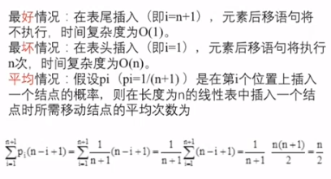
  
  - 平均时间复杂度为O(n)
  
- 删除

  - 算法流程：删除顺序表L中第i（i<i<L.length）个位置的元素，成功则返回true，并将被删除的元素用引用变量e返回，否则返回false。

  - 判断i的值是否真确

  - 取删除的元素

  - 将被删除元素后面的所有元素都一次向前移动一位

  - ```c++
    Status ListDelete(SqList &L, int i,Elemtype &e)
    {
        if(i<1||i>L.length)
            return ERROR;
        e = L.data[i-1];
        for(int j=i;j<L.length; j++)
            L.data[j-1] = L.data[j];
        --L.length;
        return OK;
}
    ```
    
  - 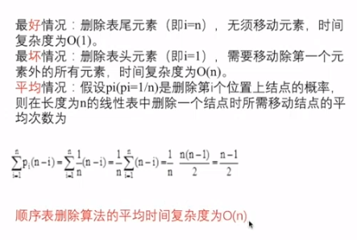

> ### 顺序表优缺点

- 优点
  - 存储密度大：不需要为表中元素之间的逻辑关系增加额外存储空间。
  - 随机存取：可以快速存取表中任一位置的元素
- 缺点
  - 插入和删除操作需要移动大量元素
  - 浪费储存空间
  - 属于静态存储形式，数据元素的个数不能自由扩充

<br>

> ### 线性表的链式表示

- 链式存储结构：结点在存储器中的位置是**任意**的，即逻辑相邻的数据元素在物理上不一定相邻。
  - 数据域：存储元素数值数据
  - 指针域：存储直接后继结点的存储位置
- 链表类型：单链表、双链表、循环链表
  - 结点只有一个指针域的链表，称为单链表
  - 有两个指针域的链表，称为双链表
  - 收尾相连的链表称为循环链表
  - 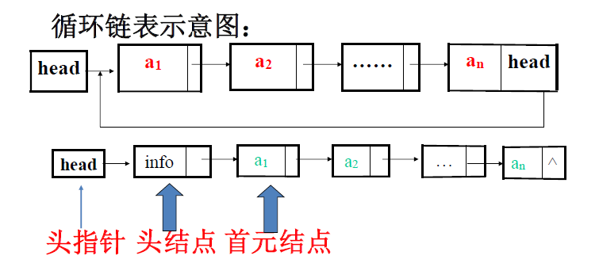
  - 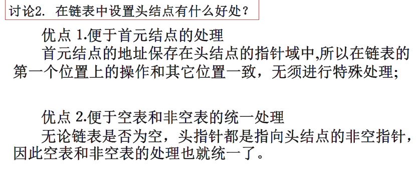
- **链表的特点**
  - 结点在存储器中的位置是任意的，逻辑上相邻的数据元素在物理上不一定相邻
  - 访问时只能通过**头指针**进入链表，并通过每个结点的指针域向后扫面，所以寻找每一个结点时间不等。
- **优缺点**
  - 优点
    - 数据元素的个数可以自由扩充
    - 插入和删除等不必移动数据，只需要修改链接指针，修改效率较高。
  - 缺点
    - 存储密度低
    - 存取效率不高，必须**顺序存取**，只能按链表的顺序进行访问

<br>

> ### 单链表的定义和实现

- 单链表存储结构定义

  - ```c++
    typedef struct LNode
    {
        ElemType data;
        struct LNode *next;
    }LNode,*LinkList;
    ```

  - LNode *p 和 LinkList p是一样的

- 初始化（构造一个空表）

  - 生成新结点作头结点，用头指针L指向头结点

  - 头结点的指针域置空

  - ```c++
    Status InitList(LinkList &L)
    {
        L = new LNode;
        L->next = NULL;
        return OK;
    }
    ```

- 销毁

  - 创建一个新结点

  - 如果L指针存在，让p和L指向同一个结点，L指向下一个，删除P指向的当前结点，直到没有结点。

  - ```c++
    Status DestroyList(LinkList &L)
    {
        LinkList p;
        while(L)  //无头结点
        {
            p = L;
            L = L->next;
            delete p;
        }
        return OK;
    }
    ```

- 清空

  - 新建两个结点

  - p指向首元结点

  - 删除节点后，让头结点的next置NULL

  - ```c++
    Status ClearList(LinkList &L)
    {
        LinkList p,q;
        p = L->next;
        while(p)
        {
            q = p->next;
            delete p;
            p = q;
        }
        L->next = NULL;
        return OK;
    }
    ```

- 求表长

  - ```c++
    int ListLength(LinkList L)
    {
        LinkList p;
        p = L->next;
        i = 0;
        while(p)
        {
            i++;
            p = p->next;
        }
        return i;
    }
    ```
  
- 判断表是否为空

  - ```c++
    int ListEmpty(LinkList L)
    {
        if(L->next) //非空
            return 0;
        else
            return 1;
    }
    ```

- 取值

  - 从第一个结点扫描，用指针p指向当前扫描到的结点

  - j作为计数器，累计扫过的结点数目

  - j=i的时候，p指向等取出的元素

  - ```c++
    Status GetElem(LinkList L, int i, ElemType &e)
    {
        p = L->next;
        while(p && j<i)
        {
            p = p->next;
            ++j;
        }
        if(!p || j>i) //第i个不存在
            return ERROR; 
        e = p->data;
        return OK;
    }
    ```

- 查找

  - 从第一个结点开始，依次和e相比较

  - 如果找到一个值和e相等的数据元素，则返回其链表位置或地址

  - 如果查找了整个链表都没有找到其值和e相等的，返回NULL

  - ```c++
    LNode *LocateElem(LinkList L, Elemtype e)//返回地址值
    {
        LinkList p;
        p = L->next;
        while(p && p->data != e)
            p = p->next;
        return p;
    }
    ```

  - ```c++
    int LocateElem(LinkList L. Elemtype e)
    // 返回位置序号
    {
        LinkList p;
        int j = 1;
        p = L->next;
        while(p && p->data!=e)
        {
            p = p->next;
            j++;
        }
        if(p)
            return j;
        else
            return 0;
    }
    ```

- 插入

  - 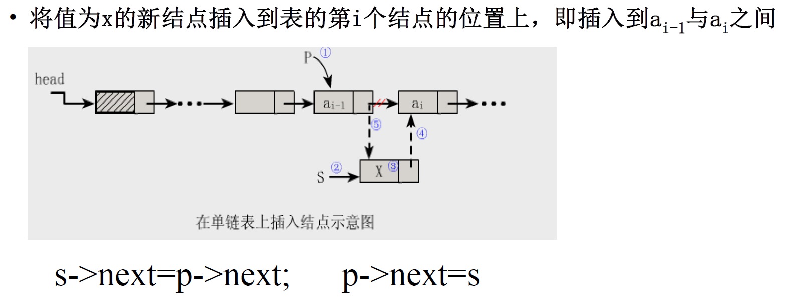

  - **先连后改**

  - 先找到前一个元素的地址p

  - 生成一个新节点*s，它的数据域为x

  - 新结点指向p所指向的ai

  - 让p指向新结点

  - ```c++
    Status ListInsert(LinkList &L,int i,ElemType e)
    {
        int j = 0;
        LinkList p;
        p = L;
        while(p&&j<i-1)//带有头结点 所以j < i-1否则就是i-2
        {
            p = p->next;
            ++j;
        }
        if(!p || j >i-1)
            return ERROR;
        s = new LNode;
        s->data = e;
        s->next = p->next;
        p->next = s;
        return OK;
    }
    ```

- 删除

  - 找到前一个结点指针

  - 保存要删除的结点的值

  - 让p->next指向当前指针的后继

  - 释放q的空间

  - 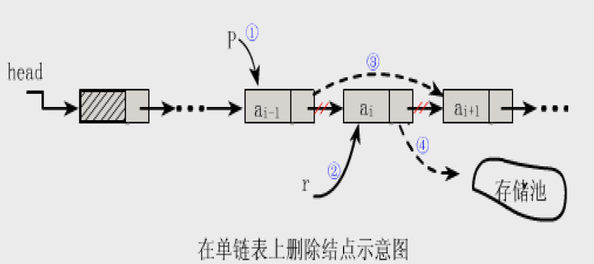

  - ```c++
    Status ListDelete(LinkList &L,int i,ElemType &e)
    {
        LinkList p = L,q;
        int j = 0;
        while(p->next && j<i-1)//有头结点 保证p->next存在是因为要删除他
        {
            p = p->next;
            ++j;
        }
        if(!(p->next)||j >i-1)
            return ERRPR;
        q = p->next;
        p->next = q->next;
        e = q->data;
        delete q;
        retuirn OK;
    }
    ```

  - 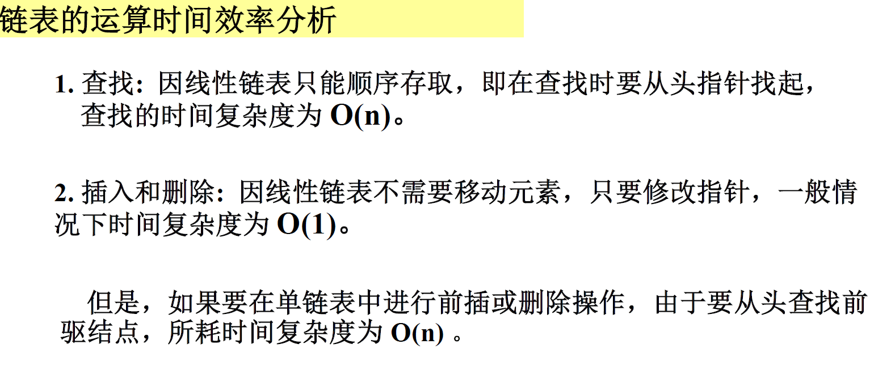

- 单链表的建立 （前插法）

  - 生成新结点

  - 讲读入数据存放在新节点的数据域中

  - 将新节点插入到链表的前端

  - 

  - ```c++
    void CreateList(LinkList &L,int n)
    {
        L = new LNode;
        L->next = NULL;
        for(int i = n; i > 0;--i)
        {
            p = new LNode;
            cin >> p->data;
            p->next = L->next;
            L->next = p;
    }
    }
    ```
    
  
- 单链表的建立（尾插法）

  - 从一个空表L开始，将新结点逐个插入链表的尾部，尾指针r指向链表的尾结点

  - 初始时，r和L均指向头结点，每读一个数据元素则申请一个新节点，将新结点插入到尾结点后，r指向新结点。

  - ```c++
    void CreateList(LinkList &L,int n)
    {
        L = new LNode;
        L->next = NULL;
        r = L;
        for(int i =0;i<n;++i)
        {
            p = new LNode;
            cin >> p->data;
            p->next = NULL;
            r->next = p;
            r = p;
        }
    }
    ```

<br>

> ### 循环链表


- 空表：L->next = L
- 循环条件： p!=L or p->next!=L (单链表是P->next != NULL)
- 尾指针： 则开始结点是rear->next->next

<br>

- **循环链表的合并**

  - 用p存表头结点

  - Tb表头连接Ta表尾

  - 释放Tb表头结点

  - 修改指针

  - ```c++
    LinkList Connect(LinkList Ta,LinkList Tb)
    {
        p = Ta->next; //存放表头结点
        Ta->next = Tb->next->next; //Tb表头连接Ta表尾
        delete Tb->next; //释放Tb表头结点
        Tb->next = p; //修改指针
        return Tb;
    }
    ```

- 约瑟夫问题

  - ```c++
    void Josephus(int n,int m)
    {
        Firster();
        for(int i =0;i < n-1;i++)
            for(int j =0;j<m-1;j++)
                Next();
        	cout<<"出列的人是"<<GetElem()<<endl;
        	ListDelete(); //删除每一趟第m个结点
    }
    ```

<br>

> ### 双向链表

- ```c++
  typedef struct DuLNode
  {
      ElemType data;
      struct DuLNode *prior;
      struct DuLNode *next;
  }DuLNode,*DuLinkList;
  ```

- 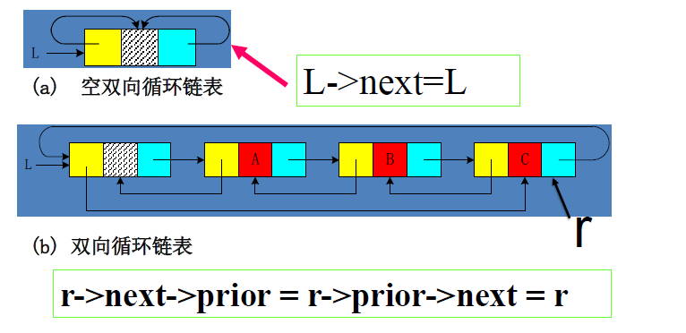

- 插入

  - 

  - ```c++
    Status ListInsert(DuLinkList &L,int i,ElemType e)
    {
        if(!(p=GetElem(L,i)))
            return ERROR;
        s = new DuLNode;
        s->data = e;
        s->prior = p->prior;
        p->prior->next = s;
        s->next = p;
        p->prior=s;
        return OK;
    }
    ```

  - **先连后改**

- 删除

  - 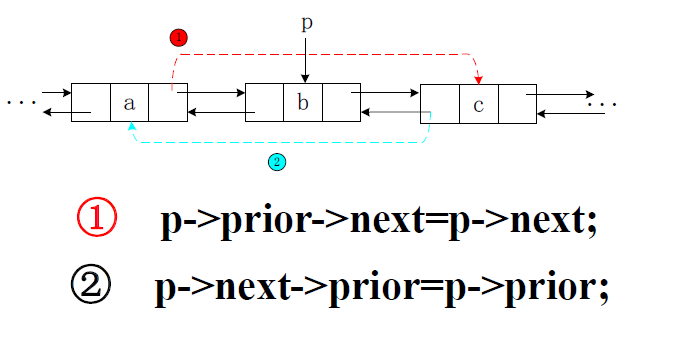

  - ```c++
    Status ListDelete(DuLinkList &L, int i,ElemType &e)
    {
        if(!(p=GetElem(L,i)))
            return ERROR;
        e = p->data;
        p->prior->next = p->next;
        p->next->prior = p->prior;
        delete p;
        return OK;
    }
    ```

- 顺序表和链表比较

  - 

- 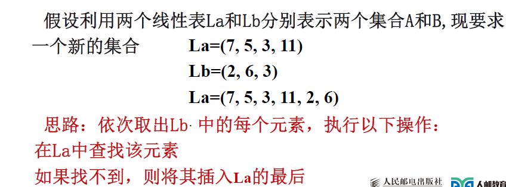

  - ```c++
    void Union(List &La, List Lb)
    {
        La_len = ListLength(La);
        Lb_len = ListLength(Lb);
        for(int i=1;i<=Lb_len;i++)
        {
            GetElem(Lb,i,e);
            if(!LocateElem(La,e))
                ListInsert(&La,++La_len,e);
        }
    }
    ```

- 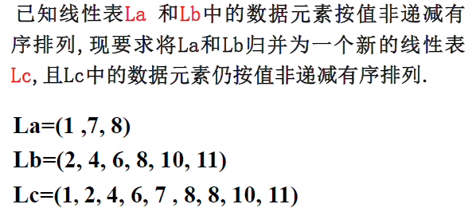

  - 创建一个空表Lc

  - 依次从La或Lb中摘取元素值较小的结点插入到Lc表的最后，直到其中一个表变空为止。

  - 继续将La或者Lb的剩下结点插入Lc中

  - ```c++
    void MergeList(SqList LA,SqList LB,SqList &LC)
    {
        pa = LA.elem; //pa指向第一个元素
        pb = LB.elem;
        LC.length = LA.length+LB.length;//新表长度为两表之和
        LC.elem = new ElemType[LC.length];//分配一个数组空间
        pc = LC.elem;//pc指向第一个元素
        pa_last = LA.elem+LA.length-1;//pa_last指向LA表的最后一个元素
        pb_last = LB.elem+LB.length-1;
        while(pa<=pa_last&&pb<=pb_last)//两表都非空
        {
            if(*pa<=*pb)//依次摘走两个表中值较小的结点
                *pc++ = *pa++;
            else
                *pc++ = *pb++;
        }
        while(pa<=pa_last)
            *pc++ = *pa++;
        while(pb<=pb_last)
            *pc++ = *pb++;
    }
    ```

  - T(n) = O(ListLength(LA)+ListLength(LB))

- 

  - Lc指向La

  - 依次从La或者Lb中摘取元素值较小的结点插入到Lc表的最后，知道其中一个表为空

  - 继续将La或Lb剩余的结点插入到Lc最后

  - 释放Lb表的表头结点

  - ```c++
    void MergeList(LinkList &La,LinkList &Lb,LinkList &Lc)
    {
        pa = La->next;
        pb = Lb->next;
        pc = Lc = La;
        while(pa && pb)
        {
            if(pa->data<=pb->data)
            {
                pc->next = pa;
                pc = pa;
                pa = pa->next;
            }
            else
            {
                pc->next = pb;
                pc = pb;
                pb = pb->next;
            }
            pc->next = pa?pa:pb;
            delete Lb;
        }
    }
    ```

  - T(n) = O(ListLength(LA)+ListLength(LB))

  - 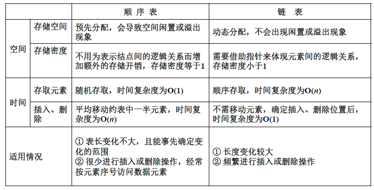

