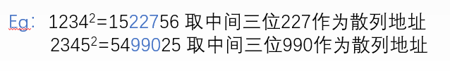
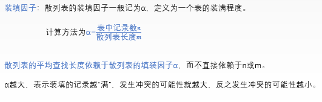

> ### 基本查找

- 一般线性表的顺序查找

  - ```c++
    typedef struct
    {
        ElemType *elem; //0号留空
        int TableLen;//表的长度
    }SSTable;
    int Search_Seq(SSTable ST,ElemType key)
    {
        ST.elem[0] = key;
        for(int i = ST.TableLen;St.elem[i] != key; --i);
        return i;
    }
    ```

- 折半查找

  - ```c++
    int Binary_Search(SeqList L,ElemType key)
    {
        int low = 0, high = L.TableLen -1, mid;
        while(low <= high)
        {
            mid = (low + high) /2;
            if(L.elem[mid] == key)
                return mid;
            else if(L.elem[mid] > key)
                high = mid - 1;
            else
                low = mid + 1;
        }
        return -1;
    }
    ```


> ### B树和B+树

- B树
  - B树中所有结点的孩子结点数的最大值是B数的阶，通常用m表示。
  - 特性
    - 每个结点至多m棵子树
    - 根结点不是终端结点的时候至少有两棵子树
    - 除了根结点外的所有非叶结点至少含有m/2取上界(至少含有m/2上界-1个关键字)
    - 所有的叶结点都在同一层次上，并且不带信息，用来判断是否查找失败，实际上不存在
    - B树是所有结点的平衡因子均为0的多路查找树
  - B树的高度
    -  
  - B树的插入
    - 可能会因为插入后导致整棵树不再满足B树的定义要求
    - 过程
      - 定位，找到插入该关键字的最底层中的某个非叶结点
      - 插入，结点的关键字数目在（m/2上界）-1到m-1之间，超过则需要分裂
      - 分裂方法：把中间位置的结点插入父结点，左右结点分开到两个结点中去，父结点如果也分裂一直到根结点就会导致高度增1
  - B树的删除：不能小于（m/2上界）-1，否则要合并
    - 当关键字k不在最底层的时候
      - 若小于k的子树中关键字个数 > 下限，则找到k的前驱来代替他
      - 若大于k的子树中关键字个数  > 下限，则找到k的后继来代替他
      - 做前后关键字个数都是下限值，啧直接把两个子节点合并，直接删除k
    - 当关键字在终端结点时
      - 若被删除关键字所在的结点关键字数目大于下限，可以直接删除
      - 兄弟够借就借兄弟，可以父子交换
      - 兄弟不够借，则吧关键字删除后与右（左）兄弟和双亲结点中的关键字进行合并
- B+树
  - 每个分支结点最多m棵子树
  - 非叶根结点至少两棵子树，其他每个分支结点至少m/2上界棵子树
  - 结点的子树个数和关键字个数相同
  - B+树中n个关键字只有n棵子树，而B树中，n个关键字的结点含有n+1棵子树
  - B+树的关键字个数n的范围是（m/2上界）<= n <= m-1
  - B+树所有非叶结点都是索引作用，不含有该关键字对应记录的存储地址
  - 查找过程中，非叶结点的关键字等于给定值时并不终止，而是继续向下查找，知道叶结点上的该关键字为止。所以查找成功与否，每次查找都是一条从根结点到叶结点的路径


> ### 散列表

- 散列函数：一个把查找表中的关键字映射成该关键字对应的地址的函数

- 冲突：散列函数可能会把两个或两个以上的不同关键字映射到同一地址

- 散列表：建立了关键字和存储地址之间的一种直接映射关系

- 构造散列函数的方法：

  - 直接定址法：H(key) = a x key +b
    - 若关键字分布不连续，空位较多
  - 除留余数法：H(key) = key % p
    - p是不大于m但是很接近或者等于m的质数
  - 数字分析法：关键字是r进制，r个数码在各位置频率不相同，应该选取数码分布较为均匀的若干位作为散列地址。
    - 适用于一直关键字集合的
  - 平方取中法：取关键字的平方值的中间几位作为散列地址
    - 适用于关键字的每位取值都不够均匀或都小于散列地址所需的位数
    - 
  - 折叠法：将关键字分割成位数相同的几部分，取这几部分的叠加和作为散列地址
    - 关键字为1234567890 散列表表长为3位 可以将关键字分为四组 每组3位
    - 123|456|789|0
      然后这四组叠加求和
      123+456+789+0=1368  然后取后3位就能得到散列地址为368

- 解决冲突的方法

  - 开放定址法：将产生冲突的Hash地址作为自变量，通过某种冲突解决函数得到一个新的空闲的Hash地址。

    - 线性探测法：冲突发生时，顺序查看表中下一个单元（当探测到表尾地址m-1时，下一个探测地址是表首地址0），直到找出一个空闲单元（当表未填满时一定能找到一个空闲单元）或查遍全表。

      - 线性探测法会造成大量元素在相邻的散列地址上“聚集”（或堆积）起来，大大降低了查找效率。
    - 
  
  - 平方探测法：设发生冲突的地址为d,平方探测法得到的新的地址序列为d+12，d-12，d+22，d-22......
  
    平方探测法是一种较好的处理冲突的方法，可以避免出现“堆积”问题，它的缺点是不能探测到散列表上的所有单元，但至少能探测到一半单元。
  
    - 
  
  - 再散列法：又称为双散列法。需要使用两个散列函数，当通过第一个散列函数H(Key)得到的地址发生冲突时，则利用第二个散列函数Hash2(Key)计算该关键字的地址增量。
  
      - 
  
    - 伪随机序列法：当发生地址冲突时，地址增量为伪随机数序列，称为伪随机序列法。
  
  - 拉链法：对于不同的关键字可能会通过散列函数映射到同一地址，为了避免非同义词发生冲突，可以把所有的同义词存储在一个线性链表中，这个线性链表由其散列地址唯一标识。拉链法适用于经常进行插入和删除的情况。
  
    - 

- 散列表查找过程
  - 先根据散列函数计算出散列地址，然后检查散列地址位置有没有关键字
  - 如果没有，表明不存在，失败
  - 如果有，检查记录是否等于关键字
    - 如果等于，成功
    - 不等于，按照给定的冲突处理办法计算下一个散列地址
- 散列表查找性能：和装填因子油管
  - 