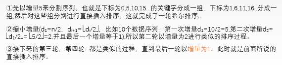
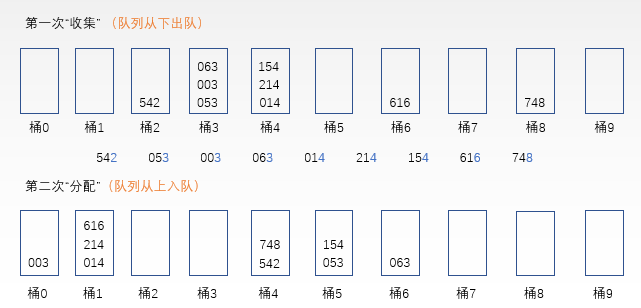
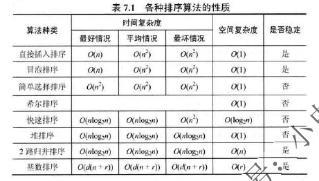

- 插入排序：首先以一个元素为有序的序列，然后将后面的元素依次插入到有序的序列中合适的位置直到所有元素都插入有序序列。

  - ```c++
    void InsertSort(ElemType A[],int n)
    {
        int i,j;
        for(i = 2; i <=n;i++)
            if(A[i].key < A[i-1].key){
                A[0] = A[i];
        		for(j = i-1;A[0].key<A[j].key;--j)
                    A[j+1] = A[j];
        		A[j+1] = A[0]
            }
    }
    ```

  - 稳定性：每次插入元素后向前先比较再移动，稳定。

  - 适用性：顺序和链式

  - 时间复杂度：O(n^2)

- 折半插入排序：在插入排序的基础上，把查找合适插入位置的方法换成了折半查找

  - ```c++
    void InsertSort(ElemType A[],int n)
    {
        int i,j,low,high,mid;
        for(i = 2;i<=n;i++)
        {
            A[0] = A[i];
            low = 1;
            high = i-1;
            while(low <= high)
            {
                mid = (low+high)/2;
                if(A[mid].key > A[0].key)
                    high = mid - 1;
                else low = mid + 1;
            }
            for(j=i-1;j>=high+1;--j)
                A[j+1] = A[j];
            A[high+1] = A[0];
        }
    }
    ```

  - 稳定性：稳定

  - 时间复杂度：O(n^2)

- 希尔排序：希尔排序本质上还是插入排序，只不过是把待排序序列分成几个子序列，再分别对这几个子序列进行直接插入排序。

  - 

  - ```c++
    void ShellSort(ElemType A[], int n)
    {
        //前后记录位置的增量是dk
        for(int dk=n/2;dk>=1;dk=dk/2)
        {
            for(int i=dk+1;i<=n;++i)
            {
                if(A[i].key<A[i-dk].key)
                {
                    A[0]=A[i];
                    for(int j=i-dk;j>0&&A[0].key<A[j].key;j-=dk)
                        A[j+dk] = A[j];
                    A[j+dk] = A[0];
                }
            }
        }
    }
    ```

  - 适用性：顺序存储

  - 稳定性：不稳定

  - 时间复杂度：O(n^2)

- 冒泡排序

  - ```c++
    void BubbleSort(ElemType A[],int n)
    {
        for(int i =0;i<n-1;i++){
            flag=false;
        	for(j=n-1;j>i;j--)
                if(A[j-1].key > A[j].key)
                {
                    swap(A[j-1],A[j]);
                    flag=true;
                }
            if(flag==flase)
                return;
        }
    }
    ```

  - 稳定性：稳定

  - 时间复杂度：O(n^2)

- 快速排序

  - ```c++
    int Partition(ElemType A[],int low , int high)
    {
        ElemType pivot = A[low];
        while(low < high)
        {
            while(low<high&&A[high]>=pivot) --hight;
            A[low] = A[high];
            while(low<high&&A[low]<=pivot) ++low;
            A[high] = A[low];
        }
        A[low] = pivot;
        return low;
    }
    woid QuickSort(ElemType A[],int low,int high)
    {
        if(low<high)
        {
            int pivotpos = Partition(A,low,high)；
            QuickSort(A,low,pivotpos-1);
            QuickSort(A,pivotpos+1,high);
        }
    }
    ```

  - 时间复杂度：O(nlog2n)

  - 稳定性：不稳定

- 选择排序：每次找最小的

  - ```c++
    void SelectSort(ElemType A[],int n)
    {
        for(i=0;i<n-1;i++)
        {
            min=i;
            for(j=i+1;j<n;j++)
                if(A[j]<A[min]) min = j;
            if(min !=i) swap(A[i],A[min]);
        }
    }
    ```

  - 稳定性：不稳定

  - 时间复杂度：O(n^2)

- 堆排序

  - 堆是一棵完全二叉树，而且满足任何一个非叶结点的值都不大于(或不小于)其左右孩子结点的值。
  - 堆排序的思想就是每次将无序序列调节成一个堆，然后从堆中选择堆顶元素的值，这个值加入有序序列，无序序列减少一个，再反复调节无序序列，直到所有关键字都加入到有序序列。

- 归并排序

  - ```c++
    ElemType *B = (ElemType *)malloc((n+1)*sizeof(ElemType));
    void Merge(ElemType A[],int low,int mid,int high)
    {
        for(int k=low;k<=high;k++)
        {
            B[k] = A[k];
        }
        for(int i=low,j=mid+1,k=i;i<=mid&&j<=high;k++)
        {
            if(B[i]<=B[j])
                A[k] = B[i++];
            else
                A[k]=B[j++];
        }
        while(i<=mid) A[k++] = B[i++];
        while(j<=high) A[k++] = B[j++];
    }
    woid MergeSort(ElemType A[],int low,int high)
    {
        if(low<high)
        {
            int mid = (low+high)/2;
            MergeSort(A,low,mid);
            MergeSort(A,mid+1,high);
            Merge(A,low,mid,high);
        }
    }
    ```

  - 时间复杂度：O(nlong2n)

  - 稳定性：稳定

- 基数排序（桶排序）

  - 
  - 稳定性：稳定
  - 时间复杂度：n个关键字，r个桶，O(d(n+r))

- 