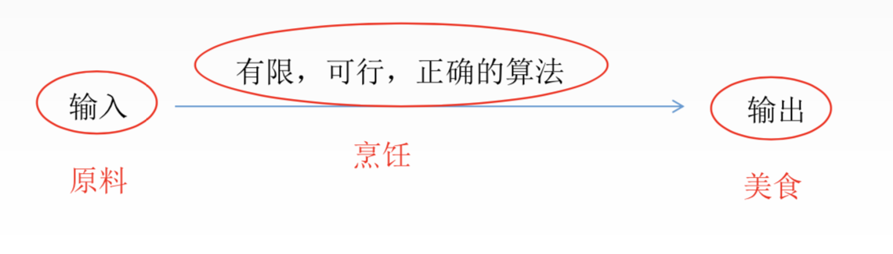

> ### 基本概念

- **数据**：数据是信息的载体，是描述客观事物属性的数字/字符以及能够输入到计算机中并被计算机程序识别和处理的符号的集合。
- **数据元素**：是数据的**基本单位**，通常作为一个整体进行考虑和处理。一个数据元素可由若干个数据项组成，数据项是构成数据元素的**不可分割的最小单位**。例如，学生记录就是一个数据元素，它由学号/姓名等数据项组成。
- **数据类型**：数据类型是一个值的集合和定义在此集合上一组操作的总称。
  - 原子类型：不可再分的数据类型。
  - 结构类型：可以再分解为若干成分的数据类型。
  - 抽象数据类型：抽象数据组织和与之相关的操作。
- **抽象数据类型**：ADT是一个**数学模型**以及定义在模型上的一组操作。抽象数据类型的定义仅取决于它的一组逻辑特性，而与其在计算机内部如何表示和实现无关。通常用**数据对象/数据关系/基本操作集**这样的三元组来表示抽象数据类型。
- **数据结构**：是相互之间存在一种或者多种特定关系的数据元素的集合。包括三个方面：**逻辑结构/存储结构/数据的运算**。一个算法的设计取决于所选定的逻辑结构。而算法的实现依赖于所采用的储存结构。

<br>

> ### 逻辑结构

**逻辑结构**：数据元素之间的逻辑关系，从逻辑关系描述数据，与数据的存储无关，是独立于计算机的。

<br>

分类：**线性结构**和**非线性结构**

<br>


<br>

**逻辑结构的种类**：

- **集合**：结构中的数据元素之间除了“同属于一个集合”的关系外，别无其它关系。类似于数学上的集合
- **线性结构**：结构中的数据元素之间只存在**一对一**的关系。/排队
- **树形结构**：**一对多**的关系。
- **图状结构**：**多对多**的关系。

<br>

> ### 物理结构

**物理结构**：数据结构在计算机中的表示。他包括数据元素的表示和关系的表示。数据的储存结构是逻辑结构用计算机语言的实现，它依赖于计算机语言。数据的存储结构：**顺序存储/链式存储/索引存储/散列存储**。

<br>

- **顺序存储**：存储的物理位置相邻。
- **链式存储**：存储的物理位置未必相邻，通过记录相邻元素的物理位置来找到相邻元素。
- **索引存储**：类似于目录。
- **散列存储**：通过关键字直接计算出元素的物理地址。

<br>

> ### 算法

<br>

**算法是对问题求解步骤的描述，通过有限序列的指令来实现。**

<br>

**算法的五大特征**：

- **有穷性**：有限步之后结束/不会出现无限循环。
- **确定性**：不存在**二义性**，算法每个步骤被精确定义。
- **可行性**：比如受限于计算机的计算能力，有些算法虽然理论上可行，但实际上无法完成。
- **输入**：能被计算机处理的各种类型数据，如数字/音频等/

 - **输出**：一至多个程序输出结果。
   	- 

<br>

> ### 算法的复杂度

**时间复杂度**：

- 他用来衡量算法随着问题规模增大，算法执行时间的**增长的快慢**。
- 时间复杂度是问题规模的函数：记为T(n),时间复杂度主要分析T(n)的**数量级**。
- T(n)=O(f(n)),一般我们考虑最坏情况的**时间复杂度**。

<br>

**空间复杂度**：

- 他用来衡量算法随着问题规模增大，算法所需**空间**的增长快慢。
- 是问题规模函数：S(n) = O(g(n))。

<br>

常见时间复杂度大小关系：

- O(1) < O(logn) < O(n) < O(nlogn) < O($ n^2$) < O($n^3$) < O($2^n$)

<br>

```c++
int sum = 0; //执行一次
for(int i = 0; i <=n ; i++) // int i = 0 一次， i<=n n+2次 i++ n+1次
{
  sum = sum+i; // n+1次
} //共3n+6
```

- 假设每个语句执行时间一致，均为常数t。则总时间T=(3n+6)t。

- 随着问题规模n的增大，总时间的增长率与n的增长率一致，所以复杂度为O(n)。

- 复杂度可以忽略**常数项**。
- 一般可以直接关注**循环段基本操作语句**的**执行次数**。

<br>

```c++
int sum = 0;
for(int i = 1; i <= n; i = 2*i)
{
  sum = sum+i;
}
```

- 设循环体的执行次数为k
- i取1，2，4，8.···
- 满足条件$2^k$<= n   即k>logn时跳出循环

<br>

> ### 空间复杂度

**空间复杂度S(n)**:算法运行过程中使用的**辅助空间**的大小。

<br>

- 辅助空间：除了存储算法本身的指令/常数/变量/输入数据外，还需要存储对数据操作的存储单元。
- 算法**原地工作**是指算法所需的辅助空间是常量，即O(1)。