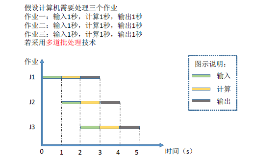
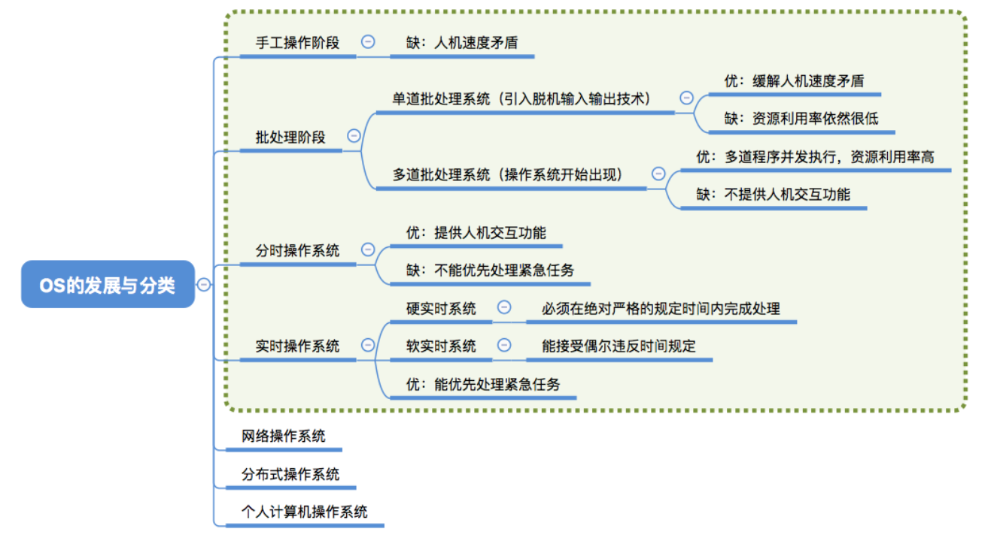

> ### 发展和分类

- **手工操作阶段**
  - 缺点
    - 用户独占全机
    - 人机速度矛盾导致资源利用率低下
- **批处理阶段**
  - **单道批处理系统**
    - 引入脱机输入/输出技术（用磁带完成），并监督程序负责控制作业的输入、输出
    - 优点
      - 环节了一定的人机速度矛盾
    - 缺点
      - 内存只能有一道程序运行，CPU大量的时间是空闲等待。资源利用率很低。
  - **多道批处理系统**
    - 优点
      - 并发执行，共享计算机资源。**资源利用率大幅提升**。
    - 缺点
      - 用户响应时间长，**没有人机交互功能**。
    - 
    - 
- **分时操作系统**
  - 计算机以**时间片**为单位轮流为各个用户/作业服务，各个用户可通过终端与计算机进行交互。
  - 优点
    - 用户请求可以被即时相应，解决人机交互问题。
    - 允许多个用户同时使用一台计算机
  - 缺点
    - **不能优先处理一些紧急任务**。公平分配给作业。
- **实时操作系统**
  - 要在严格的时限内处理完时间。主要特点是**及时性和可靠性**
  - 优点
    - 能优先响应一些紧急任务，某些紧急任务不需时间片排队。
  - 硬实时系统：必须在绝对严格的规定时间内完成处理。
  - 软实时系统：能偶尔违反时间规定。
- **网络操作系统**：实现网络中各种资源的共享和各台计算机之间的通信。
- **分布式操作系统**：分布性和并行性。任何工作都可以分布在这些计算机上，由他们并行协同完成这个任务。
- 

