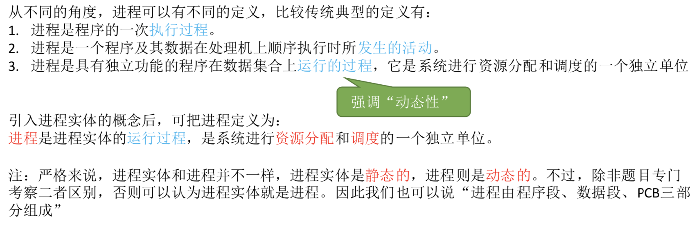
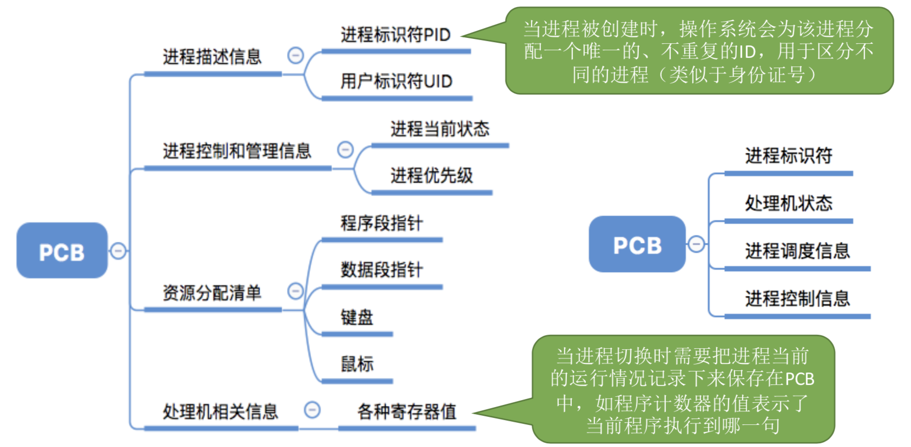
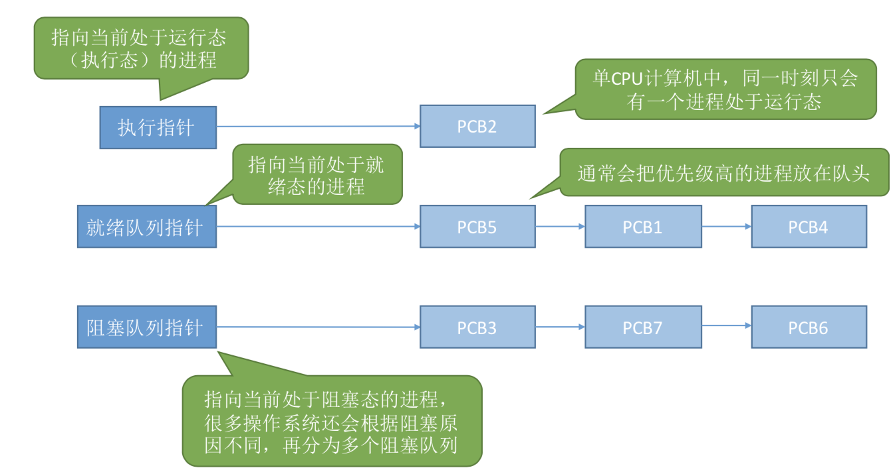
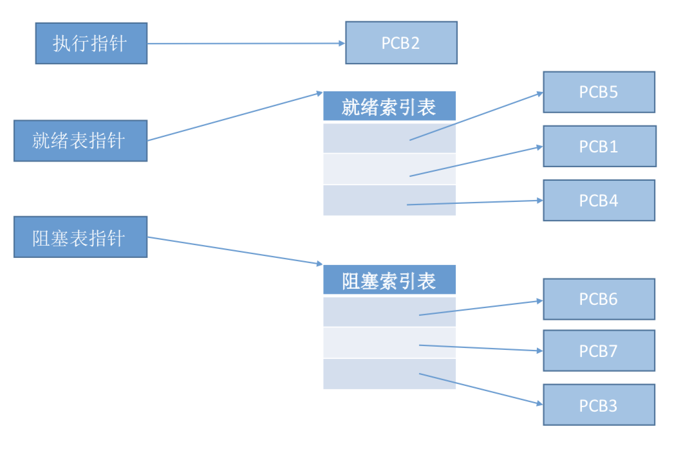
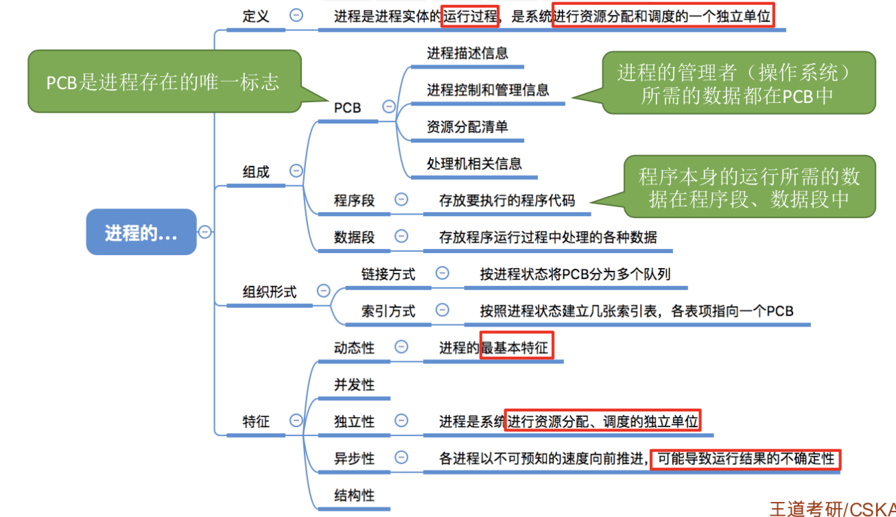
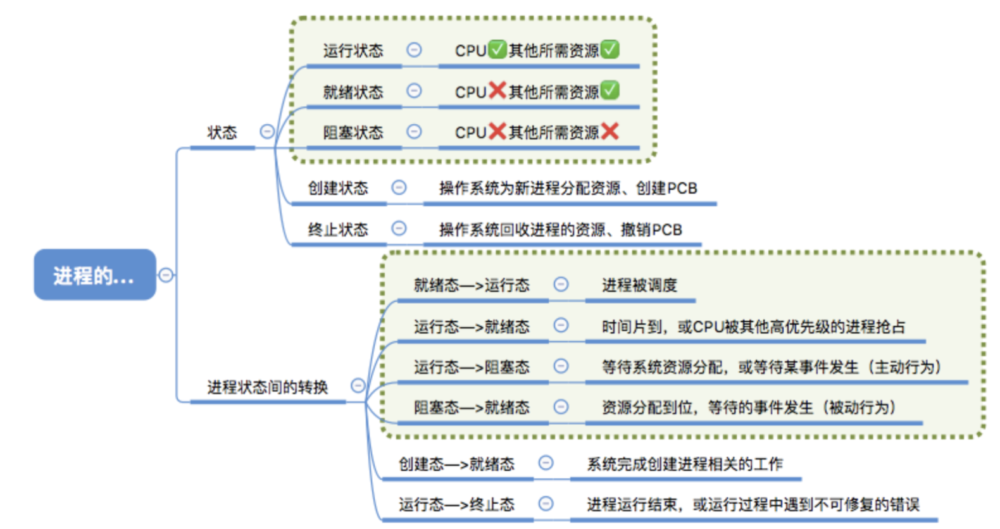
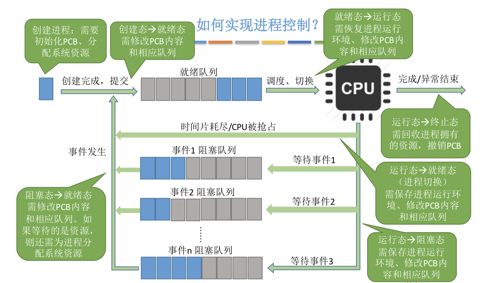
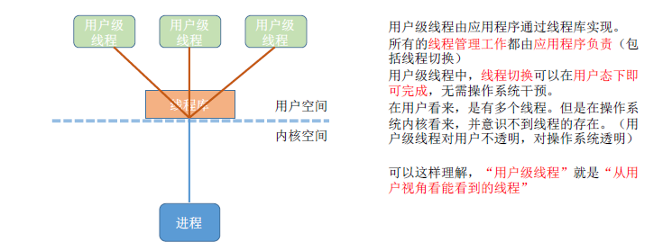
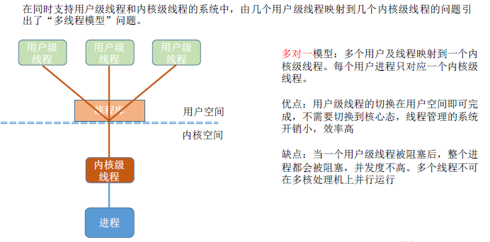
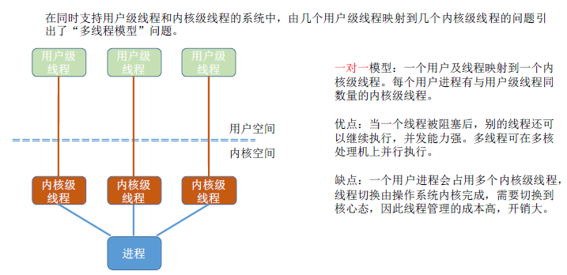

> ### 进程的定义

- 程序：一个指令序列
- 程序段/数据段/PCB构成**进程实体**
  - 创建进程实质上就是创建进程实体中的PCB
- 
- 程序段：程序代码存放在这里
- 数据段：程序运行时使用/产生的运算数据。如全局变量/局部变量等
- 
- 

 

> ### 进程的组织

- 进程的组成讨论的是一个进程内部由那些部分构成的问题，而进程的组织讨论的是多个进程之间的组织方式问题
- 进程的组织方式
  - 链接方式
    - 按照进程状态将PCB分为多个队列
    - 操作系统持有指向各个队列的指针
    - 
  - 索引方式
    - 根据进程状态的不同，建立几张索引表
    - 操作系统持有指向各个索引表的指针
  - 

 

> ### 进程的特征

- 动态性：进程是程序一次执行过程，是动态地产生/变化和消亡的
  - **动态性**是进程最基本的特征
- 并发性：内存中有多个进程实体，各进程可并发执行
- 独立性：进程是能独立运行/独立获得资源/独立接受调度的基本单位
  - **进程是资源分配/接受调度的基本单位**
- 异步性：各进程独立的/不可预知的速度向前推进，操作系统要提供“进程同步机制”来解决异步问题
- 结构性：每个进程都会配置一个PCB。结构上看，进程由程序段/数据段/PCB组成
- 

 

> ### 进程的状态和转换

- 进程
  - 状态
    - 运行状态
    - 就绪状态
    - 阻塞状态
    - 创建状态
    - 终止状态
  - 进程状态间的转换
    - 就绪态-运行态
    - 运行态-就绪态
    - 运行态-阻塞态
    - 阻塞态-就绪态
- 三种基本状态
  - 
  - 

 

> ### 进程控制

- 主要功能是对系统中的所有进程实施有效管理
  - 进程控制就是要实现进程状态转换
  - 
- 如何实现进程控制
  - 
  - 用**原语**实现进程控制。
  - 原语的特点是不允许中断，这种不可被中断的操作是原子操作
  - 原语采用关中断指令和开中断指令实现
- **原语做的事情**
  - 更新PCB信息
    - 所有的进程控制原语一定都会修改进程状态标志
    - 剥夺当前运行进程的CPU使用权必然需要保存运行环境
    - 某个进程开始运行前需要恢复运行环境
  - 将PCB插入合适队列
  - 分配/回收资源
  - 
  - 阻塞和唤醒要成对出现

 

> ### 进程通信

- 进程通信就是进程之间的信息交换
  - 为了保证安全，一个进程不能直接访问另一个进程的地址空间。
  - 进程之间的信息交换又是必须实现的。
- 进程通信
  - 共享存储
    - 两个进程对共享空间的访问是**互斥**的，操作系统只负责提供共享空间和同步互斥工具
    - **基于数据结构的共享**：比如共享空间里只放一个长度为10的数组。这种共享方式速度慢、限制多，是一种低级通信方式。
    - **基于存储区的共享**：在内存中画出一块共享存储区，数据的形式、存放位置都由进程控制，速度快一些，是一种高级通信方式。
  - 消息传递
    - 
  - 管道通信
    - 管道是指用于连接读写进程的一个共享文件，就是内存中开辟一个固定大小的**缓冲区**。
    - 管道只能采用**半双工通信**，若要实现双向同时通信，啧需要两个管道
    - 各进程要**互斥**访问管道
    - 没写满，就不允许读。没读空，就不允许写
    - 读进程最多只能由一个
  - 

 

> ### 线程概念和多线程模型

- 线程可以看作“轻量级进程”
- 线程是一个基本的CPU执行单元，也是程序执行流的最小单元。
- 引入线程后，不仅进程之间可以并发，进程内的各个线程之间也可以并发，使得一个进程内也可以并发处理各种任务。
- 引入线程后，进程只作为除了CPU之外的系统资源的分配单元，如打印机，内存地址空间
- 线程成为**处理机的分配单元**
- 
- 线程的属性
  - 线程是处理机调度的单位
  - 多CPU计算机中，各个线程可占用不同的CPU
  - 每个线程都有一个线程ID，线程控制块（TCB）
  - 线程也有就绪、阻塞、运行三种基本状态
  - 线程几乎不占有系统资源
  - 同一进程的不同线程间共享进程的资源
  - 由于共享内存地址空间，同一进程中的线程间通信甚至无需系统干预
  - 同一进程中的线程切换，不会引起进程切换
  - 不同进程中的线程切换，会引起进程切换
  - 切换同进程内的线程，系统开销很小
  - 切换进程，系统开销较大
- 线程的实现方式
  - 用户级线程
  - 
  - 内核级线程
  - 
  - 两者组合
  - 
- **多线程模型**
  - 多对一模型
  - 
  - 一对一模型
  - 
  - 多对多模型
  - 
- 

