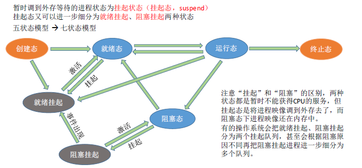
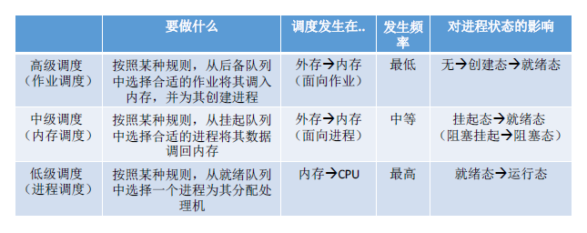
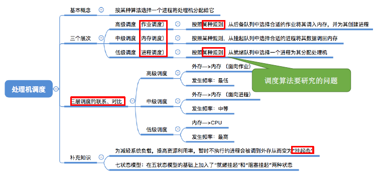
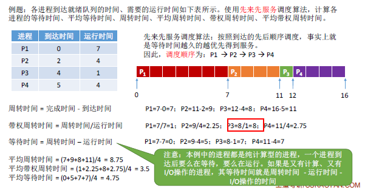
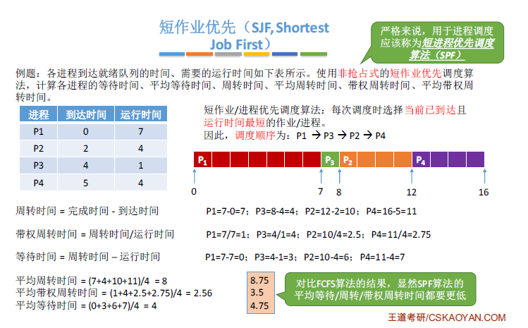
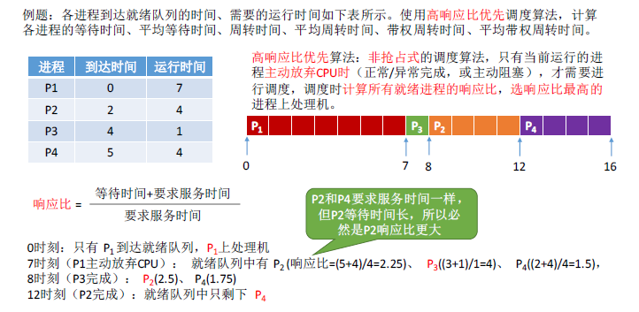
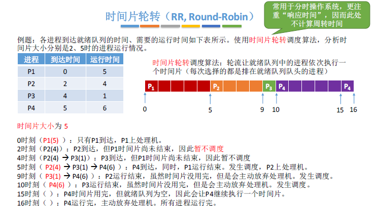
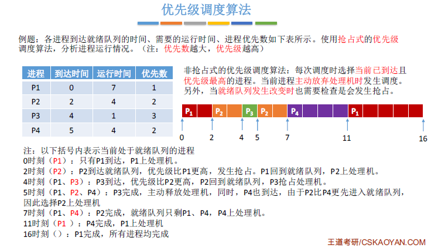

> ### 处理机调度概念、层次

- 基本概念
  - 在多道程序系统中，进程多于处理机的个数，这样不可能同时并行处理各个进程。
  - 处理机调度，就是从就绪队列中按照一定的算法选择一个进程并将处理机分配给它运行，以实现进程的并发执行。
- 调度的三个层次
  - 高级调度
    - 由于内存有限，有时无法将用户提交的作业全部**放入内存**，因此需要确定某种规则把作业调入内存的顺序
    - 按一定的原则从外存上处于后备队列的作业挑选一个或者多个作业，给他们分配内存等必要资源，并且**建立相应的进程（建立PCB）**，获得竞争处理机的权利
    - **高级调度是外存和内存之间的调度。**每个作业只能调入一次，调出一次。作业调入时会建立相应的PCB，作业调出才撤销PCB。
  - 中级调度
    - 引入了虚拟存储之后，可将暂时不能运行的进程调到外存等待。等它重新具备了运行条件且内存有空闲，再重新调入内存。
    - 目的是为了提高内存利用率和系统吞吐量
    - 暂时调到外存成为挂起，**PCB还在内存**。
    - 中级调度，就是要决定将那个处于挂起状态的进程重新调入内存。
    - 一个进程可能多次调出调入内存，因此中级调度发生频率要比高级调度高。
    - 
  - 低级调度
    - 主要任务是按照某种方法和策略从就绪的队列中选区一个进程，将处理机分配给他
    - **进程调度**是操作系统中最基本的一种调度
    - 进程调度的频率**很高**
  - 三种调度对比
  - 
  - 

 

> ### 进程调度的时机、切换与过程、调度方式

- 进程调度就是按照某种算法从就绪队列中选择一个进程为其分配处理机
  - 需要进行进程调度
    - 进程主动放弃处理机
      - 进程正常终止
      - 运行过程中发生异常而终止
      - 进程主动请求阻塞（等待I/O）
    - 进程被动放弃处理机
      - 分给进程的时间片用完
      - 有更紧急的事需要处理
      - 有更高优先级的进程进入就绪队列
  - 不能进行进程调度
    - 在处理中断的过程中
    - 线程在操作系统内核程序临界区
    - 在原子操作过程中
- 临界资源：一段时间内只允许一个进程使用的资源。
- 临界区：访问临界资源的那段代码。
- **进程调度的方式**
  - 非剥夺调度方式
    - 只允许进程主动放弃处理机
    - 实现简单，系统开销小但是无法及时处理紧急任务，适用于早起的批处理系统
  - 剥夺调度方式
    - 如果有更重要的程序需要处理机，将处理机分配给更重要的进程
    - 可以优先处理，适用于分时操作系统，实时操作系统
- 切换和过程
  - 
- 

 

> ### 调度算法的评价指标

- CPU利用率
  - 利用率=忙碌时间/总时间
- 系统吞吐量
  - 单位时间内完成作业的数量
  - 系统吞吐量=总共完成了多少道作业/总共花了多少时间
- 周转时间
  - 是从作业提交给系统开始，到作业完成的时间
  - 包括四个部分
    - 作业在外存后备队列上等待作业调度的时间（高级）
    - 进程在就绪队列上等待进程调度的时间（低级）
    - 进程在CPU上执行的时间
    - 进程等待I/O操作完成的时间
  - 周转时间=作业完成时间-作业提交时间
  - 平均周转时间=各作业周转时间之和/作业数
  - 带权周转时间=作业周转时间/作业实际的运行时间
  - 平均带权周转时间=各作业带权周转时间之和/作业数
- 等待时间
  - 进程/作业处于等待处理机状态时间之和，等待时间时间越长，用户满意度越低。
- 响应时间
  - 指从用户提交请求到首次产生响应所用的时间
- 

 

> ### 调度算法

- 先来先服务
  - 算法思想：生活中的排队
  - 算法规则：按照作业/进程到达的先后顺序进行服务
  - 用于作业/进程调度：考虑的是那个作业先到后备队列/那个进程先到就绪队列
  - 是否可抢占：非抢占
  - 优缺点
    - 优点：公平，简单
    - 缺点：对长作业有利，对短作业不利
  - 是否会导致饥饿：不会
  - 
- 短作业优先
  - 算法思想：追求最少的平均时间，最少的平均周转时间
  - 算法规则：最短的作业/进程优先得到服务
  - 用于作业/进程调度：可用于作业调度，也可以用于进程调度
  - 是否可以抢占：非抢占式，抢占式的是最短剩余时间优先算法
  - 优缺点
    - 优点：最短的平均等待时间、平均周转时间
    - 缺点：不公平。**对短作业有利，对长作业不利。**可能会有饥饿现象
  - 是否会导致饥饿：会，长作业可能会得不到服务。
  - 
- 高响应比优先
  - 算法思想：综合考虑作业的等待时间和要求服务的时间
  - 算法规则：每次调度时计算各个作业的响应比，选择响应比最高的作业为其服务
    - 响应比=（等待时间+要求服务时间）/要求服务时间
  - 用于作业/进程调度：都可以
  - 是否可抢占：非抢占的算法
  - 优缺点
    - 综合考虑了等待时间和运行时间（要求服务时间）
    - 等待时间相同时，要求服务时间段的优先（SJF的优点）
    - 要求的服务时间相同时，等待时间长的优先（FCFS的优点）
    - 对于长作业，随着等待时间越来越久，响应比也会越来越大，避免长作业饥饿问题
  - 是否会导致饥饿：不会
  - 
- 对比
  - 
- 时间片轮转
  - 算法思想：公平轮流为各个进程服务，让每个进程在一定时间间隔内都可以得到响应
  - 算法规则：按照各进程到达就绪队列的顺序，轮流让各个进程执行一个时间片。
  - 用于作业和进程调度：只能用于进程调度
  - 是否可抢占：属于抢占式算法，由时钟装置发出时钟中断来通知CPU时间片已到。
  - 优缺点：
    - 优点：公平，响应快，适用于分时操作系统
    - 缺点：由于高频率的进程切换，因此有一定开销，不区分任务的紧急程度
  - 是否会导致饥饿：不会
  - 
- 优先级调度
  - 算法思想：越来越多应用场景需要根据任务的紧急程度来决定顺序
  - 算法规则：调度时选择优先级最高的作业/进程
  - 用于作业/进程调度：可以作业调度，也可以进程调度
  - 是否可抢占：非抢占只需要在进程放弃处理机时进行调度即可。而抢占式需要在就绪队列变化时，检查是否发生抢占。
  - 优缺点
    - 优点：用优先级区分紧急程度，适用于实时操作系统
    - 缺点：若高优先级进程源源不断，可能导致饥饿
  - 是否会导致饥饿：会
  - 
- 多级反馈队列调度算法
  - 算法思想：对其他调度算法的折中权衡
  - 算法规则：
    - 设置多级就绪队列，各级队列优先级从高到低，时间片从小到大
    - 新进程到达时进入第一级队列，按FCFS原则排队等待被分配时间片，若时间片进程还未结束，则进程进入下一级队列队尾。如果此时已经是最下级，则重新放回改队列队尾
    - 只有第k级队列为空，才会为k+1队头的进程分配时间片
  - 用于作业和进程：只用于进程调度
  - 是否抢占：抢占式，在k级队列运行过程中，若有上级队列进入了一个新进程，则会抢占
  - 优缺点
    - 优点
      - 相对公平
      - 每个新到达的进程都可以很快得到响应
      - 短进程只用较少的时间就可以完成
      - 不必实现估计进程的运行时间
  - 是否会导致饥饿：会
- 