> ### 进程同步和互斥

- 同步
  - 直接制约关系，为了完成某种任务而建立的两个或多个进程，这些进程因为需要在某些位置上协调他们的工作次序而产生的制约关系。
- 互斥
  - 进程的并发需要共享，各个并发执行的进程不可避免的需要一些系统资源的共享
  - 两种资源共享方式
    - 互斥共享：一个时段内只允许一个进程访问该资源
    - 同时共享：允许一个时间段内多个进程同时对他进行访问
  - 一段时间内只允许一个进程使用的资源叫作**临界资源**，变量、数据、内存缓冲区等都属于邻接资源
  - 实现临界资源的互斥访问
    - 空闲让进：可以允许一个请求进入临界区的进程立刻进入临界区
    - 忙则等待：有进程进入临界区时，其他试图进入临界区的进程必须等待
    - 有限等待：对请求访问的进程，应保证能有限时间内进入临界区
    - 让权等待：当进程不能进入临界区时，应立刻释放处理机
- 

 

> ### 进程互斥的软件实现方法

- 单标识法
  - 算法思想：两个进程在访问完临界区后悔吧使用临界区的权限交给另一个进程。也就是说每个进程进入临界区的权限只能被另一个进程赋予
  - 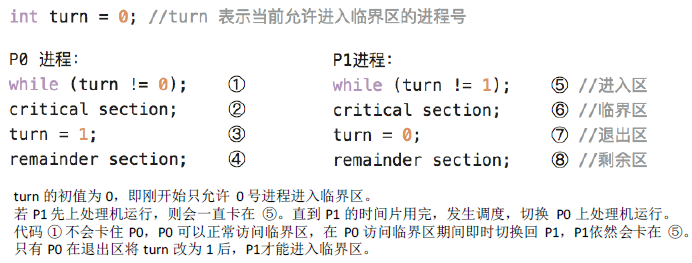
  - 单标志法违背了“空闲让进”原则
- 双标志先检查法
  - 设置一个布尔型数组flag[]，数组中各个元素用来标记各进程想进入临界区的意愿
  - 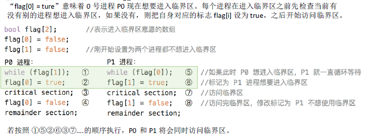
  - 违反了忙则等待，在检查后，上锁前可能发生进程切换。
- 双标志后检查法
  - 双标志先检查法的改版，先上锁再检查的方法
  - 
  - 解决了忙则等待的问题，但是违反了空闲让进和有限等待
- Peterson算法
  - 算法思想：在争着进入临界区的时候可以主动让对方使用临界区。
  - 
  - 解决了互斥的问题，遵循了空闲让进、忙则等待、有限等待三个原则，但是依然未能遵循让权等待原则。
- 

 

> ### 进程互斥的硬件实现

- 中断屏蔽方法
  - 利用**开关中断指令**实现
    - 关中断：不允许当前进程被中断，不会发生进程切换
    - 开中断：执行后才可能有别的进程上处理机并访问临界区
  - 优点：简单高效
  - 缺点：不适合多处理机，适合操作系统内核进程，不适合用户进程（只能运行在内核态）

- TestAndSet指令
  - 是用硬件实现的，执行的过程不允许被打断
  - 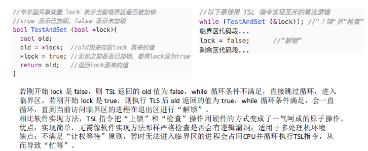
- swap指令
  - 是用硬件实现的，执行的过程不允许被打断
  - 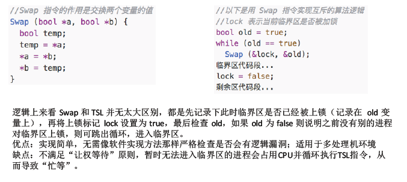
- 

 

> ### 信号量机制

- 所有解决方案都无法实现“让权等待”
- 信号量机制：有效的实现进程互斥和同步的方法
- 用户可以通过实用操作系统提供的**一对原语**来对**信号量**进行操作
- 信号量表示系统中某种资源的数量，比如系统中有一台打印机，就可以设置信号量为1。
- 原语执行是一气呵成的，不可被中断。是由关中断和开中断实现的
- **一对原语**：wait(s)和signal(s)，括号内是信号量s
- wait和signal原语常常简称为PV操作
- 整型信号量
  - 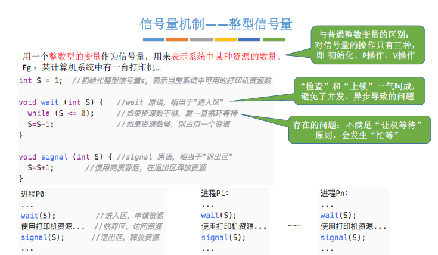
- 记录型信号量
  - 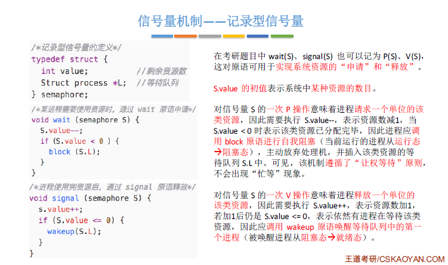
- 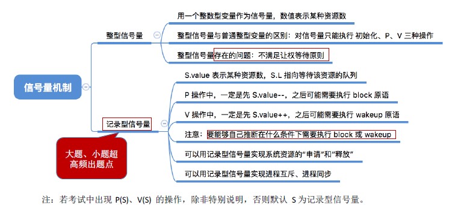

 

> ### 信号量机制

- 互斥
  - 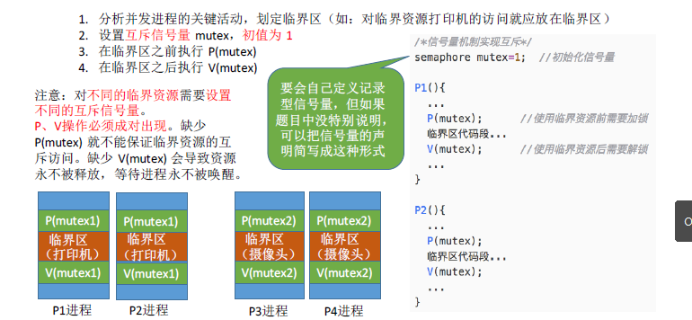
- 同步
  - 
- 前驱关系
  - 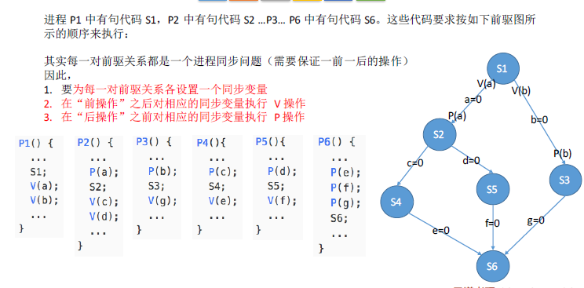
- 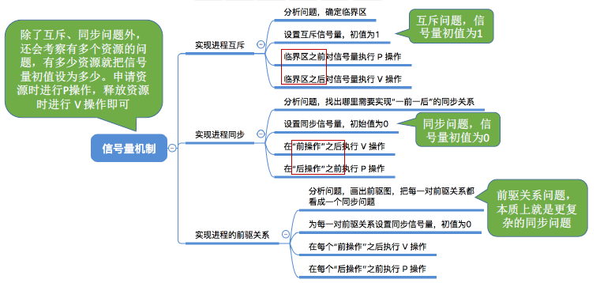

 

> ### 生产者消费者问题

- 系统中有一组生产者进程和一组消费者进程，生产者进程每次生产一个产品放入缓冲区，消费者进程每次从缓冲区去除一个产品并使用
- 只有缓冲区没满，生产者才能把产品放入，否则必须等待。
- 只有缓冲区不空，消费者才能从中取出产品，否则必须等待。
- 缓冲区是临界资源，各进程必须互斥访问
- 实现
  - 

 

> ### 多生产者-多消费者

- 问题描述：一个盘子，爸爸放苹果，妈妈放句子，儿子等吃橘子，女儿等吃苹果。只有盘空才放。
- 
  - 可以不用互斥信号量
- 总结：如果缓冲区为1，可能不需要互斥信号量就可以实现缓冲区的功能

 

> ### 吸烟者问题

- 问题描述
  - 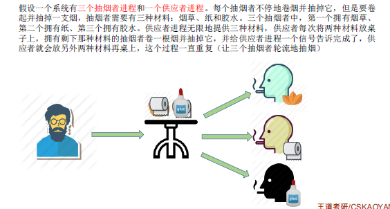
- 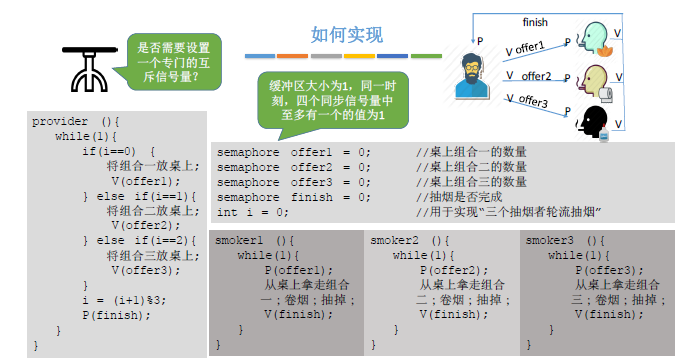

 

> ### 读者-写者问题

- 问题描述
  - 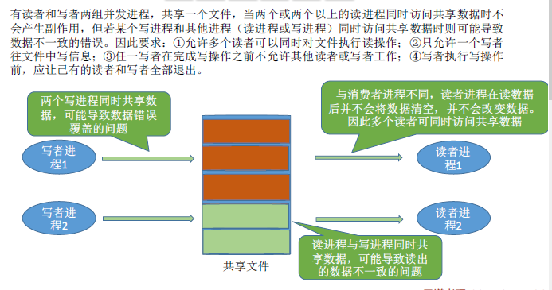
- 实现
  - 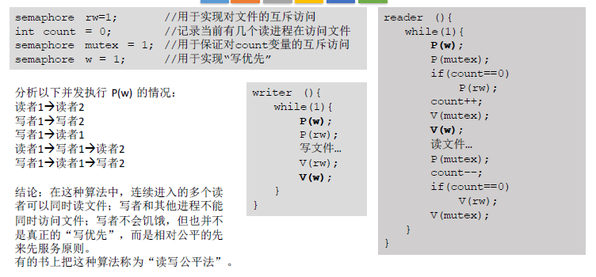

 

> ### 哲学家进餐问题

- 问题描述
  - 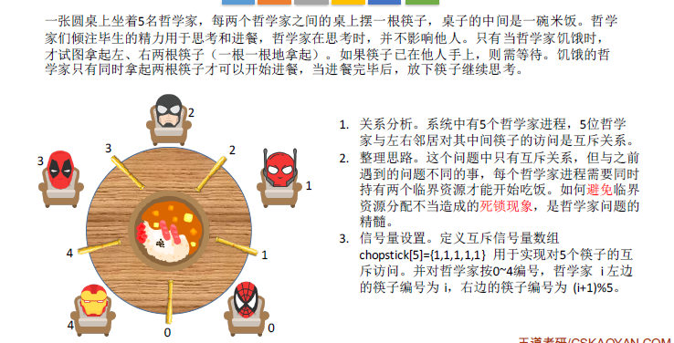

- 实现
  - 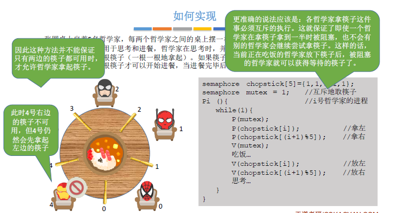
- 哲学家进餐的关键在于解决进程死锁

> ### 管程

- 为什么引入管程
  - 信号量机制编写程序困难，容易出错
  - 管程是一种高级的同步机制
  - 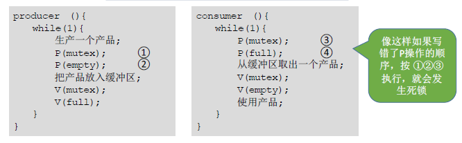
- 定义和基本特征
  - 组成
    - 局部于管程的共享数据结构说明
    - 对该说结构进行操作的一组过程（函数）
    - 对局部于管程的共享数据设置初始值的语句
    - 管程有一个名字

- 基本特征
  - 局部与管程的数据只能被局部与管程的过程访问
  - 一个进程只能通过调用管程内的过程才能进入管程访问共享数据
  - 每次进允许一个进程在管程内执行某个内部过程
- 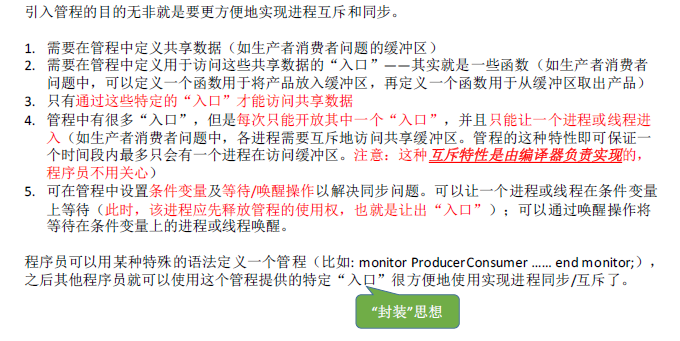
- 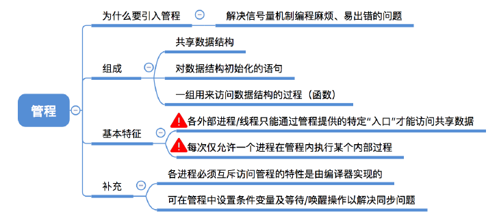