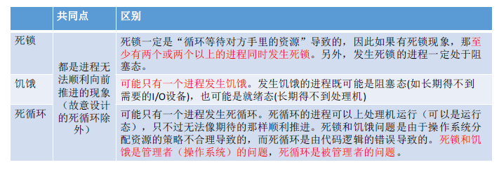
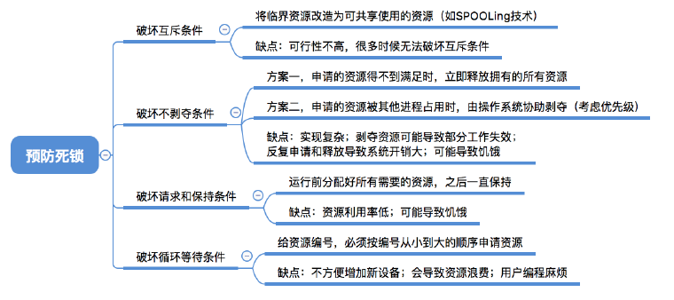
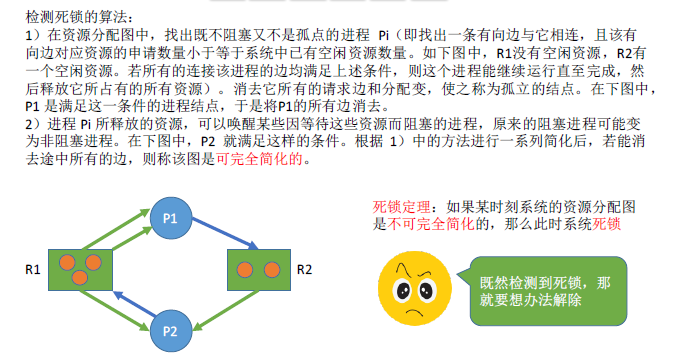

> ### 死锁的概念

- 死锁
  - 各进程互相等待对方手里的资源，导致各进程都阻塞，无法向前推进的现象。
- 饥饿
  - 长时间得不到想要的资源，某进程无法向前推进的现象。
  - 如短进程优先中，源源不断的短进程到来，长进程会一直得不到处理机
- 死循环
  - 某进程执行过程中一直跳不出某个循环的现象
- 区别和共同点
  - 
- 死锁产生的必要条件
  - 互斥条件
    - 只有对互斥使用的资源的争抢才会导致死锁
  - 不剥夺条件
    - 进程所获得的的资源在未使用完之前，不能被其他进程强行夺走
  - 请求和保持条件
    - 进程已经保持了至少一个资源，又提出新的资源请求，该资源被其他进程占有，这时候的请求进程被阻塞，但又对自己的资源保持不放。
  - 循环等待条件
    - 存在一种进程资源的循环等待链，链汇总的每个进程已获得的资源同时被下一个进程所请求。
  - 注意
    - 发生死锁一定循环等待，但发生循环等待时未必死锁
- 死锁的处理策略
  - 预防死锁
    - 破坏死锁产生的四个必要条件中的一个或几个
  - 避免死锁
    - 用某种方法防治系统进入不安全状态，从而避免死锁（银行家算法）
  - 死锁的检测和解除
    - 允许死锁的发生，不过操作系统会负责检测出死锁的发生，然后采取某种措施来解除死锁
- 

 

> ### 预防死锁

- 破坏互斥条件
  - 互斥条件：只有对必须互斥使用的资源的争抢才会导致死锁
  - 如果把只能互斥使用的资源改造为允许共享使用，就不会进入死锁
  - 缺点：不是所有的资源都可以共享的（保护系统安全）
- 破坏不剥夺条件
  - 不剥夺条件：进程所获得的的资源在未使用完之前，不能由其他进程强行夺走，只能主动释放。
  - 破坏方法
    - 立刻释放，之后可以重新申请
    - 由操作系统协助，将想要的资源强行剥夺
  - 缺点
    - 实现复杂
    - 释放已经获得的资源可能导致前一个阶段的工作失效
    - 反复申请和释放资源会增大系统开销，降低系统吞吐量
- 破坏请求和保持条件
  - 请求和保持条件：进程已经保持了至少一个资源，又请求其他资源，这个资源被其他资源占有，此时请求进程被阻塞，但是又对自己的资源保持不放
  - 采用静态分配方法：在运行前就一次申请完它需要的全部资源
  - 缺点
    - 运行期间一直保持着所有资源，会造成严重的资源浪费，资源利用率很低。
- 破坏循环等待条件
  - 循环等待条件：存在一个进程资源的循环等待链，每个进程一伙的的资源同时被下一个进程请求
  - 顺序资源分配法：规定每个进程必按编号递增的顺序请求资源，同类资源一次申请完
  - 缺点
    - 不方便增加新的设备，因为可能需要重新分配所有的编号
    - 进程实际使用资源的顺序可能和编号增加的顺序不一致，会导致资源浪费
    - 必须按规定次序申请资源，用户编程麻烦
- 

 

> ### 避免死锁

- 安全序列：如果系统按照这种序列分配资源，则每个进程都能顺利完成。只要能找出一个安全序列，系统就是安全状态。
  - 如果系统处于安全状态，就一定不会发生死锁
  - 在资源分配之前预先判断这次分配是否会导致系统进入不安全状态，再决定是否要答应资源的分配请求，这就是银行家算法的核心思想
- 银行家算法
  - 核心思想：在进程提出资源申请时，先预判此次分配是否导致系统进入不安全状态。如果进入不安全状态，就暂时不答应这次请求，让该进程先阻塞等待。
  - 
- 

 

> ### 检测和接触死锁

- 资源分配图
  - 两种结点
    - 进程结点：对应一个进程
    - 资源结点：对应一类资源，一类资源可能有多个
  - 两种边
    - 进程结点-资源结点：想申请几个资源
    - 资源结点-进程结点：已经为进程分配了几个资源
- 
- 死锁的解除
  - 一旦检测出死锁的发生，就应该立即接触死锁
  - 并不是系统中所有的进程都是死锁状态，用死锁检测算法化简资源分配图后，还连着边的那些进程就是死锁进程
  - 解除死锁的方法
    - 资源剥夺法：挂起（暂时放到外存上）某些死锁进程，并抢占他的资源。
    - 撤销进程法：强制撤销部分死锁进程，方法简单但是代价很大，一旦终止就功亏一篑必须从头再来
    - 进程回退法：让一个或者多个死锁进程回退到足以避免死锁的地步。这要求系统要记录进程的历史信息，设置还原点。
- 