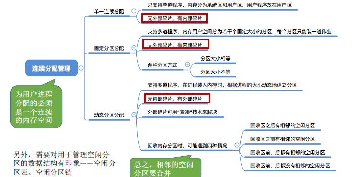
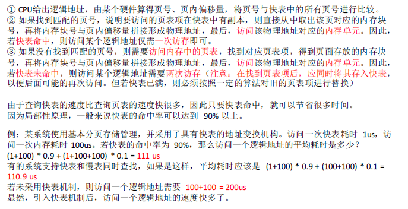
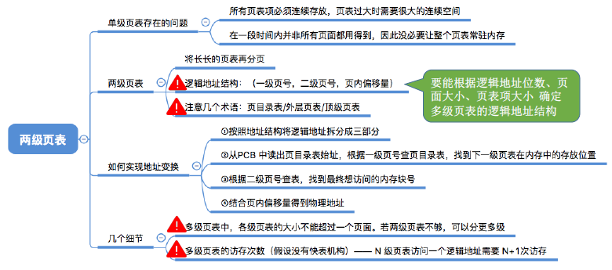
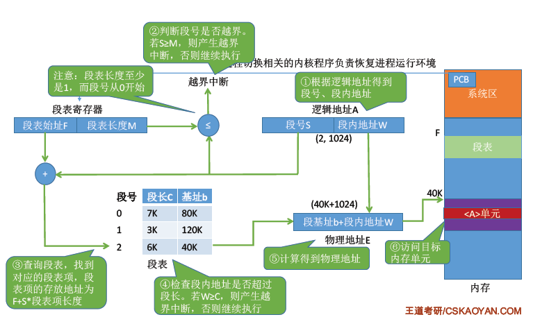
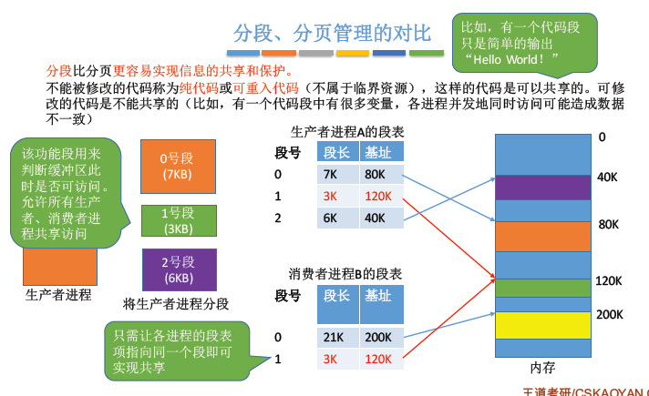
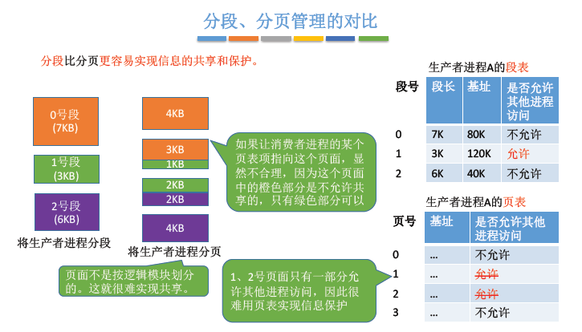

> ### 内存的基础知识

- 内存是用于存放数据的硬件，程序执行前需要先放到内存中才会被CPU处理。
- 每个地址对应着一个存储单元
- 进程的运行原理-指令
  - 
- 地址
  - 逻辑地址：相对地址
  - 物理地址：绝对地址
- 从写程序到程序运行
  - 
  - 编辑源代码文件
  - 编译：编译程序将用户源代码编译成若干个目标模块（高级语言翻译成机器语言）
  - 链接：链接程序将编译后形成的一组目标模块，以及库函数一起，形成一个完整的装入模块
  - 装入：装入程序把装入模块装入内存运行
- 装入的三种方式
  - 绝对装入：在编译的时候，如果知道程序将放到内存中的那个位置，编译程序将产生绝对地址的目标代码。装入程序按照装入模块中的地址，将程序和数据装入内存。
    - 适合用于单道程序环境
  - 静态重定位：可重定位装入。编译和链接后的装入模块地址都是从0开始，指令中使用的地址和数据存放的地址都是相对于起始地址而言的**逻辑地址**。
    - 特点：一个作业装入内存的时候，必须分配其要求的全部内存空间，如果没有足够的内存空间就不能装入。
  - 动态重定位：编译链接后的装入模块的地址都是从0开始的。软如程序把装入模块装入内存后，不会立刻把逻辑地址转换为物理地址，而是把地址转换推迟到程序真正要执行的时候。需要重定位寄存器。
    - 可把程序分配到不连续的存储区中，根据需要动态分配内存，允许程序在内存内发生移动
- 链接的三种方式
  - 静态链接：在程序运行之前，把各个目标模块和他们所需要的库函数连接成一个完整的可执行文件，之后不再拆开
  - 装入动态链接：把各个目标模块装入内存时，边装入边链接的链接方式
  - 运行动态链接：在程序执行中需要该目标模块，才进行链接。优点是方便修改和更新，实现对目标模块的共享。

- 

 

> ### 内存管理的概念

- 
- 操作系统负责内存空间的分配和回收
- 操作系统需要提供某种技术从逻辑上对内存空间进行扩充-虚拟技术
- 地址转换
  - 操作系统负责逻辑地址和物理地址的转换
  - 三种装入方式
    - 绝对装入：编译时产生绝对地址（单道程序，还没操作系统）
    - 可重定位装入：装入时把逻辑地址变为物理地址（早期多道批处理操作系统）
    - 动态运行装入：运行时把逻辑地址转换为物理地址，需要重定位寄存器
- 内存保护
  - 在CPU设置一对上下限寄存器，存放进程的上下限地址。进程的指令要访问某个地址，CPU检查是否越界。
  - 采用重定位寄存器和界地址寄存器进行越界检查。重定位寄存器中存放的是进程的其实物理地址。界地址寄存器中存放的是进程的最大逻辑地址。

 

> ### 覆盖和交换

- 
- 覆盖技术
  - 解决程序打下超过物理内存总和的问题
  - 覆盖思想：将程序分为多个段，常用的段常驻内存，不用的段需要时才调入内存
  - 一个固定区
    - 调入后不再调出
  - 多个覆盖区
    - 需要用才调入内存，不用就不调入内存
  - 必须由程序员生命覆盖结构，操作系统自动覆盖
  - 缺点：不透明，已经成为了历史
- 交换技术
  - 交换思想：内存空间紧张，系统将内存某些进程暂时换出外存，把外存某些具备运行条件的进程换入内存
  - 中级调度（内存调度）：决定将哪个处于挂起状态的进程重新调入内存
  - 暂时换出外存的进程状态为挂起状态
    - 分为就绪挂起和阻塞挂起
- 

 

> ### 连续分配管理方式

- 
- 单一连续分配
  - 内存被分为系统区和用户区，只能有一道用户程序，独占内存空间
  - 优点
    - 实现简单
    - 无外部碎片
    - 可以采用覆盖技术扩充内存
  - 缺点
    - 只能单用户和单任务的操作系统
    - 有内部碎片，存储器利用率低
- 固定分区分配
  - 为了能在内存装入多道程序，又不互相干扰，于是把整个用户空间划分成若干个固定大小的分区，每个分区只装入一道作业。
  - 分区分配
    - 大小相等
      - 缺少灵活性，但适合用于用一台计算机控制多个相同对象的场合
    - 大小不等
      - 增加了灵活性，可以满足不同大小的进程需求
  - 优点
    - 实现简单，无外部碎片
  - 缺点
    - 用户程序太大时，可能所有的分区都不能满足需求，不得不采取覆盖
    - 会产生内部碎片，内存利用率低
- 动态分区分配
  - 不预先划分内存分区，进程装入内存的时候，根据进程的大小动态建立分区。
  - 动态分区没有内部碎片，但是有外部碎片
  - 内部碎片：分配给进程的内存区域，如果某些部分没有用上
  - 外部碎片：指内存中的某些空闲分区由于太小难以利用
  - 可以通过拼凑技术来解决

 

> ### 动态分区分配算法

- 首次适应算法
  - 每次都从低地址开始查找，找到第一个能满足大小的空闲分区。
  - 如何实现：空闲分区以地址递增的次序排列。每次分配内容时顺序查找空闲分区链，找到大小能满足要求的第一个空闲分区。
- 最佳适应算法
  - 算法思想：由于动态分区分配是一种连续分配方式，为各个进程分配的空间必须是连续的一整片区域。为了让大进程到来的时候有连续的大片空间，可以尽可能多留下大片的空闲区，优先使用更小的空闲区。
  - 如何实现：空闲分区按容量递增次序链接。每次分配内存时顺序查找空闲分区链，找到大小能满足要求的第一个空闲分区。
  - 缺点：每次都找最小的分区进行分配，会留下越来越多的，很小的，难以利用的内存块。因此这用方法会产生很多的外部碎片。
- 最坏适应算法
  - 算法思想：为了解决最佳适应算法的问题（留下太多难以利用的小碎片），可以在每次分配优先使用最大的连续空闲区，分配后剩余的空闲区就不会太小，方便使用。
  - 如何实现：空闲分区按容量递减次序链接。每次分配内存时顺序查找空闲分区链，找到大小能满足要求的第一个空闲分区。
  - 缺点：每次都选最大的分区进行分配，虽然可以让分配后留下的空闲区更大，更可用，但是这种方式会导致较大的连续空闲区被迅速用完。如果有打进程到达，就没有内存分区可用了。
- 邻近适应算法
  - 算法思想：首次适应算法每次都从链头开始查找。可能会导致低地址部分出现很多小的空闲分区，而每次分配查找时，都经过这些分区，因此也增加了查找的开销。如果每次都从上次查找结束的位置开始检索，就解决上述问题。
  - 如何实现：空闲分区以地址**递增的顺序排列**，每次分配内存从上次查找结束位置开始查找空闲分区链，找到大小能满足要求的第一分区。
- 

 

> ### 基本分页存储管理的基本概念

- 
- 连续分配方式的缺点
  - 固定分区分配：缺乏灵活性，会产生大量的内部碎片，内存的利用率低下
  - 动态分区分配：会产生很多外部碎片，虽然可以用紧凑技术处理，但是紧凑的时间代价很高
  - 基于这个思想，产生了“非连续分配方式”，或者称为“离散分配方式”
- 基本概念
  - 将内存空间分为一个个大小相等的分区，每一个分区就是页帧/内存块/物理块，每一个页框有内存块号，从0开始
  - 操作系统以页框为单位为各个进程分配内存空间，进程的页面和内存的页框有一一对应的关系
- 地址转换
  - 计算出逻辑地址对应的页号
  - 找出对应页面的内存中的存放位置
  - 算出逻辑地址对应的页内偏移量
  - 物理地址 = 页面始址 + 页内偏移量
- 页号 = 逻辑地址/页面大小
- 页内偏移量 = 逻辑地址%页面大小
- 页表
  - 操作系统为每一个进程建立一张页表
  - 一个进程对应一张页表
  - 进程的每一页对应一个页表项
  - 每个页表项有页号和块号
  - 页表记录进程页面和实际存放的内存块之间的对应关系
  - 每个页表项的长度是相同的

 

> ### 基本地址变换机构

- 
- 基本地址变换可以借助进程的页表将逻辑地址转换为物理地址
- 页表寄存器：存放页表在内存中的起始地址F和页表长度M。程序未执行的时候，页表的始址和页表长度放在进程控制块中，当进程被调度时，操作系统内核会把他们放到页表寄存器
- 

 

> ### 具有快表的地址变换机构

- 局部性原理
  - 时间局部性：如果执行了程序中的某指令，不久后这条指令很有可能再次执行。数据也一样
  - 空间局限性：一旦程序访问了某个存储单元，不久之后，附近的存储单元也可能被访问
  - 基本地址变化机构中，每次访问一个逻辑地址，都需要查询内存汇总的页表。由于局部性原理，可能连续很多次查到都是同一个页表项
- 快表
  - 联想寄存器，是一种访问速度比内存快很多的高速缓冲存储器，用来存放当前访问的若干页表项，加速地址变换过程。内存中的页表叫慢表
  - 
  - 引入快表后，地址的变换过程
  - 

> ### 两级页表

- 
- 单级页表存在的问题
  - 所有页表必须连续存放，页表过大需要很大的连续空间
  - 在一段时间内并非所有页面都用得到，没必要把页表常驻内存
- 两级页表
  - 按照地址结构将逻辑地址拆分成三部分
  - 从PCB中读出页目录表始址，再根据一级页号查页目录表，找到下一级页表在内存中的存放位置
  - 根据二级页号查表，找到最终想访问的内存块号
  - 结合页内偏移量得到物理地址

- 

> ### 基本分段存储管理方式

- 
- 分段
  - 进程的地址空间：按照程序自身的逻辑关系划分成若干个段，每个段都有段名，每段从0开始编址
  - 内存分配规则：以段为单位分配，每个段在内存中占据连续空间，但是各段之间可以不相邻
  - 分段的**逻辑地址结构**:段号和段内地址（段内偏移量）组成
    - 段号的位数：决定每个进程最多可以分为几个段
    - 段内地址位数：决定了每段的最大长度多少

- 段表
  - 程序分多个段，各段离散装入内存，为了保证程序能正常运行，就必须能从物理内存中找到各个逻辑段的存放位置，所以需要每个进程建立一张段映射表
  - 每个段对应一个段表项，记录了该段在内存中的起始位置和段的长度
  - 各个段表项的长度相同
- 地址变换
  - 
- 分段、分页管理的对比
  - 页是信息的物理单位
    - 分页的主要目的是为了实现离散分配，提高内存利用率。分页仅仅是系统管理上的需要，对用户不可见
  - 段是信息的逻辑单位
    - 分段的主要目的是为了更好满足用户需求。一个段通常包含一组属于一个逻辑模块的信息。分段对用户是可见的
  - 页的大小固定且系统决定。
  - 段的长度不固定，用于编写
  - 分页的用户进程地址空间是一维的，程序员秩序给一个记忆符即可表示一个地址
  - 分段的用户进程地址空间是二维的，程序员在标识一个地址，要给出段名和段内地址。
  - 
  - 
- 

 

> ### 段页式管理方式

- 
- 分页和分段的优缺点
  - 分页
    - 优点：内存空间利用率高，不会产生外部碎片，只有少量的页内碎片
    - 缺点：不方便按照逻辑模块实现信息的共享和保护
  - 分段
    - 优点：很方便按照逻辑模块实现信息的共享和保护
    - 缺点：如果段长过大，为其分配很大的连续空间不方便。会产生外部碎片
- 
- 
- 