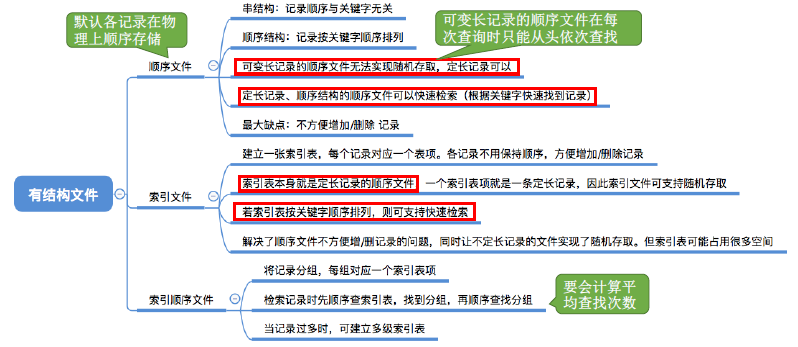
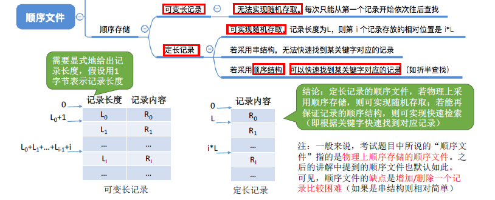
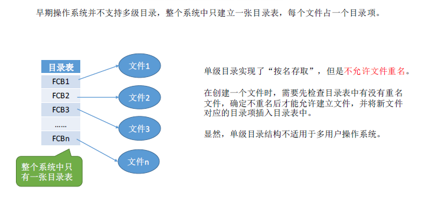
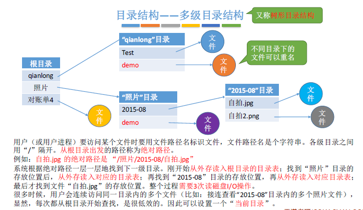
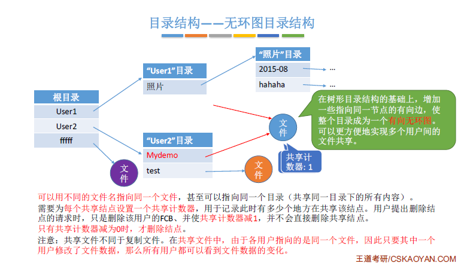
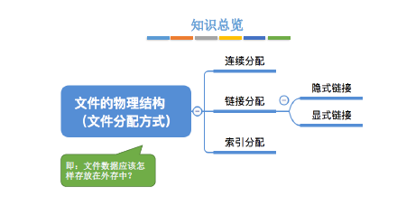

> ### 初识文件管理系统

- 
- 文件的定义：是以计算机硬盘为载体的存储在计算机上的信息集合，可以是文本文档、图片和程序
  - 计算机以进程为基本单位进行资源的调度和分配
- 文件的属性
  - 名称：文件名称唯一。
  - 标识符：标识文件系统内文件的唯一标签
  - 类型：被支持不同类型的文件系统所使用
  - 位置：指向设备和设备上文件的指针
  - 大小：文件当前大小
  - 保护：对文件进行保护的访问控制信息
  - 时间、日期和用户标识：用于保护和跟踪文件的使用
- 文件的基本操作
  - 创建文件
    - 一是在文件系统中为文件找到空间
    - 二是在目录中为新文件创建条目
  - 写文件
    - 为了写文件，执行了一个系统调用，指明文件名称和要写入文件的内容。
  - 读文件
    - 为了读文件，执行一个系统调用，指明文件名称和要读入文件块的内存位置
  - 文件重定位
    - 按某条件搜索目录，将当前文件设为给定值，并且不会读、写文件
  - 删除文件
    - 先从目录中找到要删除文件的目录项，使之成为空项，然后挥手该文件所占用的存储空间
  - 截断文件
    - 允许文件所有属性不变，并删除文件内容，即将其长度设为0并释放空间
- 
- 文件的逻辑结构：是从实现观点出发看到的文件在外存上的存储组织形式
  - 无结构文件：最简单的文件组织形式，无结构文件将数据按顺序组织成记录并积累和保存。
  - 有结构文件
    - 顺序文件
    - 
    - 索引文件
    - 
    - 索引顺序文件
    - 

- 文件目录
  - 
  - FCB:就是一个文件目录项，包含了文件的基本信息（文件名/物理地址/逻辑结构/物理结构），存取控制信息（是否可读/可写、进制访问的用户名单等），使用信息（文件的建立时间/修改时间等）
    - 搜索：当用户要使用一个文件时，系统要根据文件名搜索目录，找到该文件对应的目录项
    - 创建文件：创建一个新文件，需要在其所属的目录中增加一个目录项
    - 删除文件：当删除一个文件时，需要在目录中删除相应的目录项
    - 显示目录：用户可以请求显示目录的内容，如显示该目录中的所有文件和相应属性
    - 修改目录：某些文件属性保存在目录中，因此这些属性变化时需要修改相应的目录项
  - 目录结构
    - 单级目录结构
    - 
    - 两级目录结构
    - 
    - 多级目录结构
    - 
    - 无环图目录结构
    - 
    - 

> ### 文件的物理结构

- 
- 

