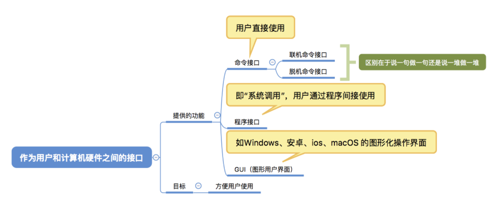
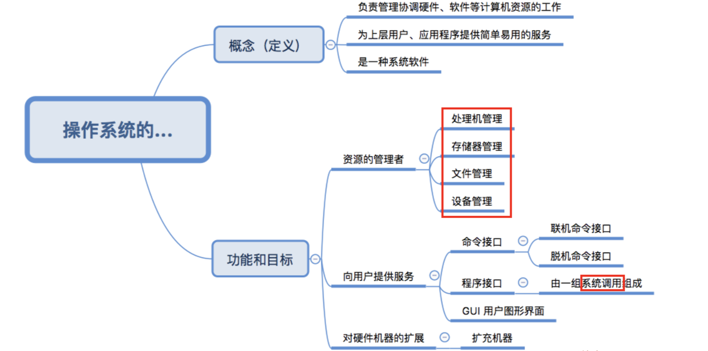

> ### 操作系统的概念/功能/目标

- **操作系统**:􏱡􏱢􏱣􏰐􏱡􏱢􏱣􏰐􏱡􏱢􏱣􏰐􏱡􏱢􏱣􏰐􏱣是指控制和管理整个计算机系统的硬件和软件资源。他是计算机系统中最基本的**系统软件**。
- 功能和目标
  - 作为系统资源的管理者
    - 处理器管理
    - 存储器管理
    - 文件管理
    - 设备管理
  - 作为用户与计算机硬件之间的接口
    - 命令接口：允许用户直接使用
      - 联机命令接口：用户说一句/系统做一句
      - 脱机命令接口：用户说一堆/用户做一堆
    - 程序接口：用户通过程序间接使用/由一组**系统调用**组成（程序接口=系统调用）
    - GUI：线代操作系统中最流行的图形用户接口
    - 
  - 作为最接近硬件的层次:实现对硬件的拓展

