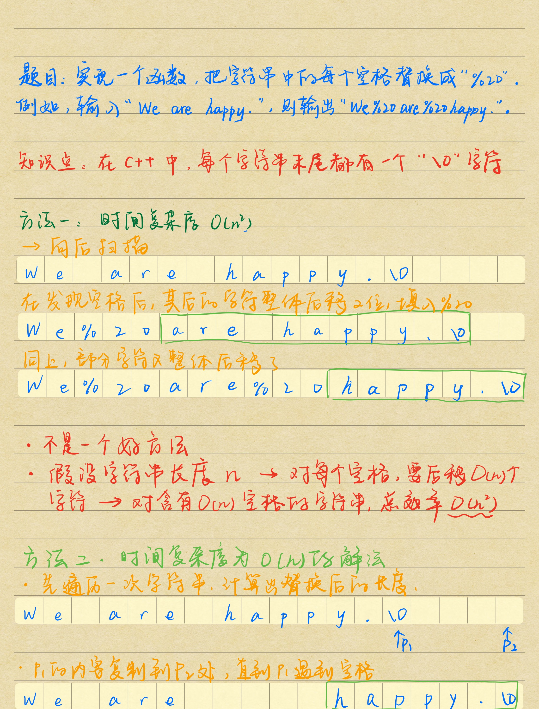
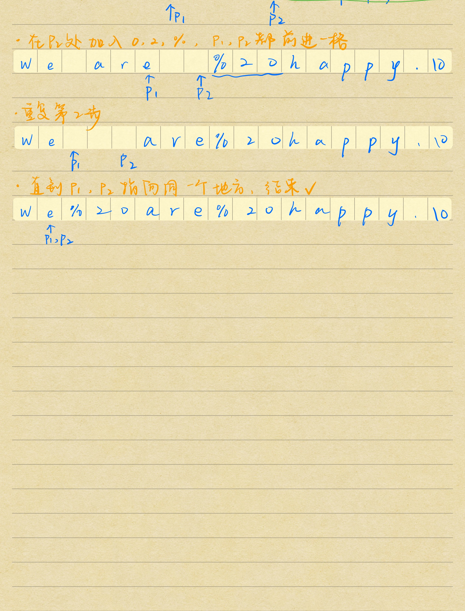

- 题目
  - 实现函数
  - 字符串的空格替换成 %20

- c++字符串：末尾 \0 字符

- 方法一：时间复杂度较高
  - 向后扫描
  - 发现空格后，在空格之后的所有字符整体后移两位，填入%20
  - 直到遍历结束

- 分析
  - 假设字符串长度为n
  - 对每个空格，要后移O(n)个字符
  - 对含有O(n)空格的字符串
  - 总效率就是O(n^2)

- 这种方法一定不是面试官想要的好方法

- 方法二：时间复杂度为O(n)的解法
  - 先遍历一次字符串，计算出替换后的长度
  - 这两个指针，p1指向当前末尾，p2指向修改后的末尾
  - p1的内容复制到p2处，直到p1遇到空格
  - 在p2处加入0/2/%，p1，p2同时都前进一格
  - 重复上面的步骤
  - 直到p1，p2指向同一个地方，就结束了

- 代码分析
  - 传入的两个值，字符串和长度容量都不能为空
  - 定义三个变量，原始数组长度，空格的数目，数组索引i
  - 进入while循环，只要没到结束符，原始数组长度++，遇到空格，空格数目++
  - 定义p2指针所需要指向的位置，也就是新的数组长度
  - 如果新的数组长度>给定的数组容量 返回空
  - 进入while，原始长度是>0的，新的长度>旧的数组长度，那么就进入循环
  - p1遇到空格的时候，p2的位置放入0/2/%，然后向前一格
  - p1遇到不是空格的时候，p2复制p1的数据，然后向前
  - p1判断完两种情况后也向前
  - 直到new和origial指向同一个位置，循环条件破坏了，就结束了




```python
def replaceSpace3(self, s):
        if not isinstance(s,str) or len(s) <= 0 or s == None:
            return ""
        spaceNum = 0
        for i in s:
            if i == " ":
                spaceNum += 1

        newStrLen = len(s) + spaceNum * 2
        newStr = newStrLen * [None]
        indexOfOriginal, indexOfNew = len(s) - 1, newStrLen - 1
        while indexOfNew >= 0 and indexOfNew >= indexOfOriginal:
            if s[indexOfOriginal] == ' ':
                newStr[indexOfNew-2:indexOfNew+1] = ['%', '2', '0']
                indexOfNew -= 3
                indexOfOriginal -= 1
            else:
                newStr[indexOfNew] = s[indexOfOriginal]
                indexOfNew -= 1
                indexOfOriginal -= 1
        return "".join(newStr)
```

