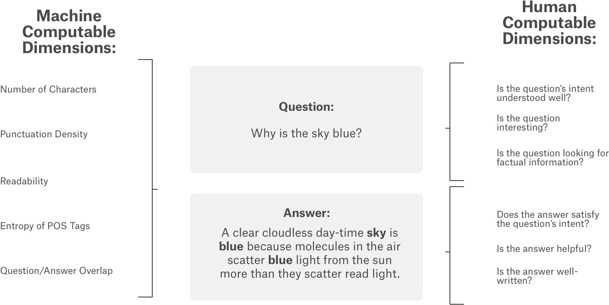

> ### Overview
- Description
  - 计算机善于回答一些简单的答案，但是人类害死比较擅长回答一些关于观点/建议/个人经验的问题。
  - 人类擅长主观问题，那些需要深入的/多维的/思考语境/这些计算机没能做的很好
  - 问题可能有多种形式/可以有多种意图/也可以寻求意见/有一些是有趣的有用的/有的问题只是简单判断对错
  - 
  - 现在很难去建立更好的主观问题回答算法/因为缺少数据和模型
  - 现在收集到了一些好的数据了
  - 在这个比赛中/可以用上这些新的数据/为主观概念的问答问题建立预测模型
  - 问题-答案对来自超过70个不同的网站

> ### Evaluation
- 计算每一列的spearman相关系数，求平均值
- 对测试集每一个qa_id
```
qa_id,question_asker_intent_understanding,...,answer_well_written
6,0.0,...,0.5
8,0.5,...,0.1
18,1.0,...,0.0
etc.
```
<br/>
<br/>
<br/>
<br/>

- <a href='#1'>1. Introduction</a>
- <a href='#2'>2. Retrieving the Data</a>
     - <a href='#2-1'>2.1 Load libraries</a>
     - <a href='#2-2'>2.2 Read the Data</a>
- <a href='#3'>3. Glimpse of Data</a>
     - <a href='#3-1'>3.1 Overview of tables</a>
     - <a href='#3-2'>3.2 Statistical overview of the Data</a>
- <a href='#4'>4. Check for missing data</a>
- <a href='#5'>5. Data Exploration</a>
    - <a href='#5-1'>5.1 Distribution of Host(from which website Question & Answers collected)</a>
    - <a href='#5-2'>5.2 Distribution of categories</a>
    - <a href='#5-3'>5.3 Distribution of Target variables</a>
    - <a href='#5-4'>5.4 Venn Diagram(Common Features values in training and test data)</a>
    - <a href='#5-5'>5.5 Distribution of Question Title</a>
    - <a href='#5-6'>5.6 Distribution of Question Body</a>
    - <a href='#5-7'>5.7 Distribution of Answers</a>
    - <a href='#5-8'>5.8 Duplicate Questions Title & Most popular Questions</a>
- <a href='#6'>6. Data Preparation & Feature Engineering</a>
    - <a href='#6-1'>6.1 Data Cleaning</a>
    - <a href='#6-2'>6.2 Feature Engineering</a>
        - <a href='#6-2-1'>6.2.1 Text Based Features</a>
        - <a href='#6-2-2'>6.2.2 TF-IDF Features</a>

# <a id='1'>1. Introduction</a>

In this competition, you’re challenged to use this new dataset to build predictive algorithms for different subjective aspects of question-answering. The question-answer pairs were gathered from nearly 70 different websites, in a "common-sense" fashion. Our raters received minimal guidance and training, and relied largely on their subjective interpretation of the prompts. As such, each prompt was crafted in the most intuitive fashion so that raters could simply use their common-sense to complete the task. By lessening our dependency on complicated and opaque rating guidelines, we hope to increase the re-use value of this data set. What you see is what you get!

 # <a id='2'>2. Retrieving the Data</a>
  ## <a id='2-1'>2.1 Load libraries</a>

```python
import pandas as pd # 为了高性能的包, 方便进行数据分析
import numpy as np # Python科学计算包
import matplotlib
import matplotlib.pyplot as plt
import seaborn as sns# 画图的
color = sns.color_palette()
import plotly.offline as py
py.init_notebook_mode(connected=True)
import plotly.graph_objs as go
import cufflinks as cf # 可视化
cf.go_offline()

# Venn
from matplotlib_venn import venn2
import re
import nltk
from nltk.probability import FreqDist
from nltk.tokenize import word_tokenize
from nltk.corpus import stopwords
import string
#nltk.download('stopwords')
eng_stopwords = stopwords.words('english')
import gc

from sklearn.feature_extraction.text import TfidfVectorizer
from sklearn.decomposition import TruncatedSVD
```

```python
import os
print(os.listdir('../Learn-Deep-Learn-With-Me/13-kaggle/Google-QUEST-Q&A-Labeling/input'))
```

 ## <a id='2-2'>2.2 Reading Data</a>
```python
print('Reading data...')
train_data = pd.read_csv('../Learn-Deep-Learn-With-Me/13-kaggle/Google-QUEST-Q&A-Labeling/input/train.csv')
test_data = pd.read_csv('../Learn-Deep-Learn-With-Me/13-kaggle/Google-QUEST-Q&A-Labeling/input/test.csv')
sample_submission = pd.read_csv('../Learn-Deep-Learn-With-Me/13-kaggle/Google-QUEST-Q&A-Labeling/input/sample_submission.csv')
print('Reading data completed')
```

```python
# 查看数据的大小
print('Size of train_data',train_data.shape)
print('Size of test_data',test_data.shape)
print('Size of sample_submission',sample_submission.shape)
```

 # <a id='3'>3. Glimpse of Data</a>
  ## <a id='3-1'>3.1 Overview of tables</a>

```python
# train data的情况
train_data.head()
```

```python
# 数据有什么属性
train_data.columns
```

```python
# 测试数据
test_data.head()
```

```python
# 测试数据的属性
test_data.columns
```

```python
# sample_submission
sample_submission.head()
```

```python
# target variables
targets = list(sample_submission.columns[1:])
targets
```

  ## <a id='3-2'>3.2 Statistical overview of the Data</a>
```python
train_data[targets].describe()
```


## <a id='4'>4. Check for missing data</a>
```python
# checking missing data in train data
total = train_data.isnull().sum().sort_values(ascending=False)
percent = (train_data.isnull().sum()/train_data.isnull().count()*100).sort_values(ascending=False)

```
