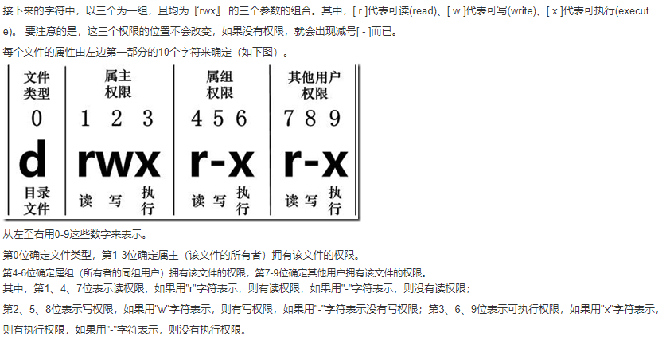

## Linux文件基本基本属性

```
[root@www /]# ls -l
total 64
dr-xr-xr-x   2 root root 4096 Dec 14  2012 bin
dr-xr-xr-x   4 root root 4096 Apr 19  2012 boot
……
```




## Linux文件属主和属组

- 用户是按组分类/一个用户属于一个或多个组

- 文件所有者以外的用户又可以分为文件所有者的同组用户和其他用户。

- Linux系统按文件所有者、文件所有者同组用户和其他用户来规定了不同的文件访问权限。

- mysql 文件是一个目录文件，属主和属组都为 mysql，属主有可读、可写、可执行的权限；与属主同组的其他用户有可读和可执行的权限；其他用户也有可读和可执行的权限。

- ```shell
  [root@www /]# ls -l
  total 64
  drwxr-xr-x 2 root  root  4096 Feb 15 14:46 cron
  drwxr-xr-x 3 mysql mysql 4096 Apr 21  2014 mysql
  ……
  ```


## 更改文件属性

- chgrp:更改文件属组
- chgrp -[R] 属组名 文件名
- -R：递归更改文件属组，就是在更改某个目录文件的属组时，如果加上-R的参数，那么该目录下的所有文件的属组都会更改。


- chown [-R] 属主名 文件名

- chown [-R] 属主名:属组名 文件名

- ```shell
  [root@www ~] cd ~
  [root@www ~]# chown bin install.log
  [root@www ~]# ls -l
  -rw-r--r--  1 bin  users 68495 Jun 25 08:53 install.log
  ```

- ```shell
  [root@www ~]# chown root:root install.log
  [root@www ~]# ls -l
  -rw-r--r--  1 root root 68495 Jun 25 08:53 install.log
  ```


- chomd 更改文件9个属性

  - 9个属性:rwxrwxrwx
  - r:4
  - w:3
  - x:1
  - owner:4+2+1=7  gropu:4+2+1 others:0 即权限770
  - chmod [-R] xyz 文件
  - xyz : 就是刚刚提到的数字类型的权限属性，为 rwx 属性数值的相加。
  - -R : 进行递归(recursive)的持续变更，亦即连同次目录下的所有文件都会变更
  - 

  ```shell
  [root@www ~]# ls -al .bashrc
  -rw-r--r--  1 root root 395 Jul  4 11:45 .bashrc
  [root@www ~]# chmod 777 .bashrc
  [root@www ~]# ls -al .bashrc
  -rwxrwxrwx  1 root root 395 Jul  4 11:45 .bashrc
  ```

  - 那如果要将权限变成 *-rwxr-xr--* 呢？那么权限的分数就成为 4+2+1/4+0+1[4+0+0]=754。


- 符号类型改变文件权限

  - ```shell
    #  touch test1    // 创建 test1 文件
    # ls -al test1    // 查看 test1 默认权限
    -rw-r--r-- 1 root root 0 Nov 15 10:32 test1
    # chmod u=rwx,g=rx,o=r  test1    // 修改 test1 权限
    # ls -al test1
    -rwxr-xr-- 1 root root 0 Nov 15 10:32 test1
    ```

  - 去掉所有的x权限

    ```shell
    #  chmod  a-x test1  
    # ls -al test1
    -rw-r--r-- 1 root root 0 Nov 15 10:32 test1
    ```

  

